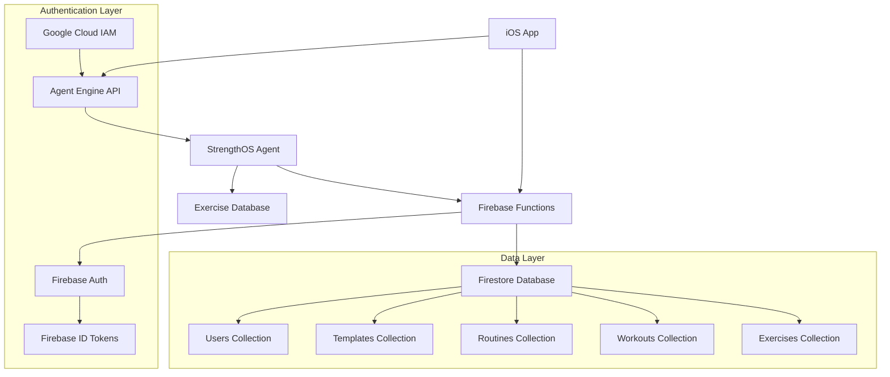
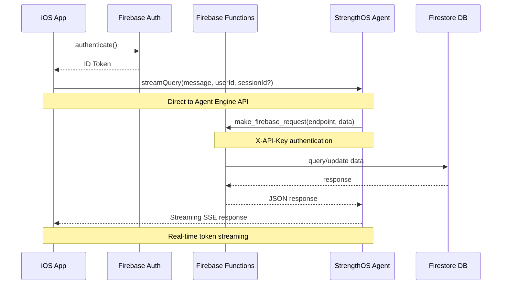

# MYON: AI-Powered Fitness Platform

MYON is a comprehensive AI-powered fitness platform that combines intelligent workout planning, personalized coaching, and comprehensive fitness tracking. The platform consists of three integrated components working together to deliver a seamless fitness experience.

## 🏗️ Architecture Overview

```
MYON Platform
├── adk_agent/          # AI Agent (Python ADK)
├── firebase_functions/  # Backend Services (Node.js)
└── MYON2/              # iOS Application (Swift/SwiftUI)
```

### Component Relationships & Data Flow



### Technical Stack Summary

| Component | Primary Tech | Model/Framework | Deployment | 
|-----------|-------------|-----------------|------------|
| **iOS App** | Swift 5.9+, SwiftUI, UIKit | MVVM + Combine | App Store |
| **Backend** | Node.js 22, Firebase Functions v6 | Domain-driven design | Google Cloud Functions |
| **AI Agent** | Python 3.10-3.12, Google ADK 1.3+ | Gemini 2.5 Flash | Vertex AI Agent Engine |

### Project Dependencies

- **Project ID**: `myon-53d85` (Firebase/GCP)
- **Agent Engine ID**: `4683295011721183232`
- **Region**: `us-central1` (required for Agent Engine Sessions)
- **Database**: Firestore with 1300+ exercises
- **Authentication**: Firebase Auth + Google Cloud IAM
- **Model**: Gemini 2.5 Flash for AI responses

### Quick Start Summary

```bash
# 1. Setup each component
cd adk_agent/strengthos-v2 && uv sync && make test
cd firebase_functions && firebase use myon-53d85 && npm install
open MYON2/MYON2.xcodeproj  # Add GoogleService-Info.plist

# 2. Deploy to production
cd adk_agent/strengthos-v2 && make deploy-agent-engine
cd firebase_functions && firebase deploy --only functions
# iOS: Archive and upload to App Store Connect

# 3. Test integration
uv run interactive_chat.py  # Test deployed agent
firebase functions:log      # Monitor function calls
```

## 📱 Detailed Component Architecture

### 1. iOS Application (`MYON2/`)

**Technology Stack**: Swift 5.9+, SwiftUI, UIKit, Combine, Firebase SDK
**Bundle ID**: `com.yourcompany.MYON2`
**Min iOS**: 17.0+

#### File Structure
```
MYON2/MYON2/
├── MYON2App.swift              # App entry point
├── Config/
│   ├── FirebaseConfig.swift    # Firebase SDK configuration
│   └── StrengthOSConfig.swift  # Agent Engine API config
├── Models/                     # Data models (Codable structs)
│   ├── User.swift              # User profile model
│   ├── Exercise.swift          # Exercise data model
│   ├── WorkoutTemplate.swift   # Template model
│   ├── Routine.swift           # Training routine model
│   ├── Workout.swift           # Completed workout model
│   ├── ActiveWorkout.swift     # In-progress workout state
│   ├── ChatMessage.swift       # AI conversation model
│   └── UserAttributes.swift    # Fitness preferences
├── Views/                      # SwiftUI views
│   ├── RootView.swift          # Root navigation container
│   ├── StrengthOSView.swift    # AI chat interface (UIKit)
│   ├── ChatViewController.swift # Chat view controller
│   ├── Components/             # Reusable UI components
│   │   ├── SharedComponents.swift
│   │   ├── TemplateComponents.swift
│   │   ├── ChatMessageCell.swift
│   │   └── MessageComposerView.swift
│   └── [Other views...]
├── Services/                   # Business logic & API clients
│   ├── AuthService.swift       # Firebase Auth wrapper
│   ├── FirebaseService.swift   # Firestore operations
│   ├── CloudFunctionService.swift # Firebase Functions client
│   ├── DirectStreamingService.swift # Agent Engine API client
│   ├── ChatService.swift       # AI conversation management
│   ├── SessionManager.swift    # Agent session persistence
│   └── StrengthOSClient.swift  # Legacy StrengthOS integration
├── Repositories/               # Data access layer
│   ├── BaseRepository.swift    # Generic repository pattern
│   ├── UserRepository.swift    # User data operations
│   ├── ExerciseRepository.swift # Exercise database access
│   ├── TemplateRepository.swift # Template CRUD
│   └── WorkoutRepository.swift  # Workout history
└── ViewModels/                 # MVVM business logic
    ├── ExercisesViewModel.swift
    └── WorkoutHistoryViewModel.swift
```

#### Key Architecture Patterns
- **MVVM + Combine**: Reactive data binding with `@Published` properties
- **Repository Pattern**: Abstracted data access with error handling
- **Service Layer**: Business logic separated from UI
- **Direct Streaming**: Real-time AI responses via SSE to Agent Engine API

#### Authentication Flow
```swift
// Firebase Auth with custom token exchange
AuthService.signIn() -> Firebase ID Token -> CloudFunctionService.exchangeToken() 
-> GCP Access Token -> DirectStreamingService.streamQuery()
```

#### Data Models (Key Schemas)
```swift
struct User: Codable {
    var name: String?
    var email: String
    var provider: String
    var uid: String
    var createdAt: Date
}

struct Exercise: Codable {
    let id: String
    let name: String
    let primaryMuscles: [String]
    let secondaryMuscles: [String]
    let equipment: String
    let level: String // "beginner", "intermediate", "advanced"
    let instructions: [String]
    let tips: [String]
}

struct WorkoutTemplate: Codable {
    let id: String
    let userId: String
    let name: String
    let description: String
    let exercises: [TemplateExercise]
    let analytics: TemplateAnalytics?
    let createdAt: Date
    let updatedAt: Date
}
```

### 2. Firebase Functions (`firebase_functions/`)

**Technology Stack**: Node.js 22, Firebase Functions v6, Firebase Admin SDK, Axios
**Runtime**: Cloud Functions Gen 2
**Region**: us-central1

#### File Structure
```
firebase_functions/functions/
├── index.js                    # Function exports
├── package.json                # Dependencies (see below)
├── user/                       # User operations (2 functions)
│   ├── get-user.js            # Get enriched user profile
│   └── update-user.js         # Update user preferences
├── exercises/                  # Exercise database (3 functions)
│   ├── get-exercises.js       # List with filters
│   ├── get-exercise.js        # Single exercise details
│   └── search-exercises.js    # Multi-filter search
├── templates/                  # Template CRUD (5 functions)
│   ├── get-user-templates.js  # List user templates
│   ├── get-template.js        # Single template
│   ├── create-template.js     # Create with validation
│   ├── update-template.js     # Update existing
│   └── delete-template.js     # Delete with cleanup
├── routines/                   # Routine management (7 functions)
│   ├── get-user-routines.js   # List user routines
│   ├── get-routine.js         # Single routine
│   ├── create-routine.js      # Create weekly schedule
│   ├── update-routine.js      # Update metadata
│   ├── delete-routine.js      # Delete with cleanup
│   ├── get-active-routine.js  # Get active training plan
│   └── set-active-routine.js  # Set active routine
├── workouts/                   # Workout history (2 functions - read-only)
│   ├── get-user-workouts.js   # List with analytics
│   └── get-workout.js         # Single workout details
├── strengthos/                 # AI agent integration
│   ├── config.js              # Vertex AI configuration
│   ├── create-session.js      # Create chat session
│   ├── list-sessions.js       # List user sessions
│   ├── query-strengthos-v2.js # New Agent Engine integration
│   ├── query-strengthos.js    # Legacy API integration
│   └── delete-session.js      # Session cleanup
├── triggers/                   # Firestore triggers (2 files)
│   ├── muscle-volume-calculations.js # Auto-calculate analytics
│   └── weekly-analytics.js    # Maintain weekly stats
├── auth/                       # Authentication middleware
│   ├── middleware.js          # Dual auth (Firebase + API keys)
│   └── exchange-token.js      # Token exchange for GCP
├── utils/                      # Shared utilities
│   ├── firestore-helper.js    # Database operations wrapper
│   └── analytics-calculator.js # Muscle volume calculations
└── health/                     # Health check
    └── health.js              # Simple health endpoint
```

#### Dependencies (`package.json`)
```json
{
  "engines": { "node": "22" },
  "dependencies": {
    "firebase-admin": "^12.6.0",
    "firebase-functions": "^6.0.1", 
    "axios": "^1.6.0",
    "google-auth-library": "^9.0.0"
  }
}
```

#### API Authentication
- **Firebase Auth**: iOS app -> Firebase Functions (ID tokens)
- **API Key Auth**: Agent -> Firebase Functions (`X-API-Key: myon-agent-key-2024`)
- **GCP Service Account**: Functions -> Vertex AI (`firebase-adminsdk-fbsvc@myon-53d85.iam.gserviceaccount.com`)

#### Firestore Collections Schema
```javascript
// Collection: users/{userId}
{
  name: string,
  email: string,
  provider: string,
  uid: string,
  created_at: timestamp,
  contextData: {
    fitnessLevel: "beginner" | "intermediate" | "advanced",
    fitnessGoals: "muscle_gain" | "strength" | "fat_loss" | "endurance",
    availableEquipment: "full_gym" | "home_gym" | "minimal",
    workoutFrequency: number,
    height: number, // cm
    weight: number, // kg
    injuries: string[],
    limitations: string[]
  }
}

// Collection: templates/{templateId}
{
  user_id: string,
  name: string,
  description: string,
  exercises: [{
    exercise_id: string,
    position: number,
    sets: [{
      id: string,
      reps: number,
      rir: number, // Reps in Reserve
      type: "Working Set" | "Warm-up" | "Drop Set",
      weight: number
    }]
  }],
  analytics: {
    projectedVolumePerMuscleGroup: object,
    setsPerMuscleGroup: object,
    weightFormat: "kg" | "lbs"
  },
  created_at: timestamp,
  updated_at: timestamp
}
```

// Collection: users/{userId}/analytics/weekly_stats/{weekId}
{
  workouts: number,
  total_sets: number,
  total_reps: number,
  total_weight: number,
  weight_per_muscle_group: object,
  weight_per_muscle: object,
  reps_per_muscle_group: object,
  reps_per_muscle: object,
  sets_per_muscle_group: object,
  sets_per_muscle: object,
  updated_at: timestamp
}
```

### 3. StrengthOS Agent (`adk_agent/`)

**Technology Stack**: Python 3.10-3.12, Google ADK 1.3+, UV package manager
**Deployment**: Vertex AI Agent Engine (Reasoning Engine)
**Model**: Gemini 2.5 Flash

#### File Structure  
```
adk_agent/strengthos-v2/
├── pyproject.toml              # UV project configuration
├── uv.lock                     # Dependency lock file
├── agent_engine_requirements.txt # Minimal deployment deps
├── deployment_metadata.json    # Current deployment info
├── Makefile                    # Development commands
├── app/
│   ├── __init__.py
│   ├── agent.py               # Agent export
│   ├── agent_engine_app.py    # AdkApp deployment wrapper
│   ├── strengthos_agent.py    # Main agent (20 Firebase tools)
│   └── utils/
│       ├── gcs.py            # Google Cloud Storage
│       ├── tracing.py        # OpenTelemetry tracing
│       └── typing.py         # Type definitions
├── tests/
│   ├── unit/                  # Unit tests
│   ├── integration/           # Integration tests
│   └── load_test/             # Locust load testing
├── notebooks/                 # Development notebooks
│   ├── intro_agent_engine.ipynb
│   ├── adk_app_testing.ipynb
│   └── evaluating_adk_agent.ipynb
├── deployment/                # Infrastructure as code
│   ├── terraform/             # Terraform configs
│   └── ci/                    # GitHub Actions
├── interactive_chat.py        # Test deployed agent
├── local_chat_with_sessions.py # Local testing
├── test_deployed_sessions.py  # Session testing
└── test_sdk_vs_api.py         # API comparison tests
```

#### Agent Configuration (`strengthos_agent.py`)
```python
# 20 Firebase-backed tools organized in 6 categories:
AGENT_INSTRUCTION = """You are StrengthOS - intelligent fitness assistant..."""

strengthos_agent = Agent(
    name="StrengthOS",
    model="gemini-2.5-flash",
    instruction=AGENT_INSTRUCTION,
    tools=[
        # User Management (2 tools)
        FunctionTool(func=get_user),
        FunctionTool(func=update_user),
        
        # Exercise Database (3 tools) 
        FunctionTool(func=list_exercises),
        FunctionTool(func=search_exercises),
        FunctionTool(func=get_exercise),
        
        # Workout Tracking (2 tools)
        FunctionTool(func=get_user_workouts),
        FunctionTool(func=get_workout),
        
        # Template Management (5 tools)
        FunctionTool(func=get_user_templates),
        FunctionTool(func=get_template),
        FunctionTool(func=create_template),
        FunctionTool(func=update_template),
        FunctionTool(func=delete_template),
        
        # Routine Management (7 tools)
        FunctionTool(func=get_user_routines),
        FunctionTool(func=get_active_routine),
        FunctionTool(func=get_routine),
        FunctionTool(func=create_routine),
        FunctionTool(func=update_routine),
        FunctionTool(func=delete_routine),
        FunctionTool(func=set_active_routine),
        
        # Memory Management (2 tools)
        FunctionTool(func=store_important_fact),
        FunctionTool(func=get_important_facts),
        FunctionTool(func=get_my_user_id),
    ]
)
```

#### Memory & Session Management
- **Vertex AI Agent Engine Sessions**: Cross-conversation persistence
- **State Management**: `tool_context.state` with "user:" prefixed keys
- **Session Isolation**: 128-character user ID limits for data isolation
- **Automatic Persistence**: State changes auto-saved by Agent Engine

#### Firebase Integration Pattern
```python
# All tools follow this pattern:
def make_firebase_request(endpoint: str, method: str = "GET", 
                         data: Optional[Dict] = None, user_id: Optional[str] = None) -> Dict[str, Any]:
    url = f"https://us-central1-myon-53d85.cloudfunctions.net/{endpoint}"
    headers = {
        "Content-Type": "application/json",
        "X-API-Key": "myon-agent-key-2024"
    }
    # Handle GET/POST/PUT/DELETE with error handling
```

## 🚀 Getting Started

### Prerequisites
- **iOS Development**: Xcode 15+, iOS 17+
- **Backend**: Node.js 18+, Firebase CLI
- **AI Agent**: Python 3.9-3.12, Google Cloud SDK
- **Accounts**: Firebase project, Google Cloud project

### Setup Instructions

#### 1. Firebase Functions Setup
```bash
cd firebase_functions/functions
npm install
firebase login
firebase use --add [your-project-id]
firebase deploy --only functions
```

#### 2. StrengthOS Agent Setup
```bash
cd adk_agent
pip install uv
uv sync
# Configure Google Cloud authentication
gcloud auth application-default login
# Deploy agent
make deploy-agent-engine
```

#### 3. iOS Application Setup
1. Open `MYON2/MYON2.xcodeproj` in Xcode
2. Add your `GoogleService-Info.plist` to the project
3. Update the bundle identifier and team settings
4. Build and run on device or simulator

### Environment Configuration

#### Required Environment Variables
```bash
# For Agent (adk_agent/.env)
GOOGLE_CLOUD_PROJECT=your-project-id
FIREBASE_API_KEY=your-firebase-key

# For Firebase Functions
FIREBASE_PROJECT_ID=your-project-id
```

#### Firebase Configuration
- Enable Authentication (Email/Password, Google Sign-In)
- Set up Firestore database with proper security rules
- Configure Cloud Functions for your region

#### Google Cloud Configuration
- Enable Vertex AI API
- Enable Agent Engine
- Set up IAM roles for service accounts

## 🔄 Technical Data Flow & Integration Patterns

### Complete Request Flow


### Authentication & Security Model
```
┌─────────────────┐    Firebase ID Token    ┌─────────────────┐
│   iOS App       │────────────────────────▶│ Firebase Funcs  │
└─────────────────┘                         └─────────────────┘
                                                      │
                                                      │ Service Account
                                                      ▼
┌─────────────────┐    Direct HTTPS/SSE     ┌─────────────────┐
│   iOS App       │────────────────────────▶│ Agent Engine    │
└─────────────────┘                         └─────────────────┘
                                                      │
                                                      │ X-API-Key
                                                      ▼
┌─────────────────┐                         ┌─────────────────┐
│ StrengthOS Agent│◀────────────────────────│ Firebase Funcs  │
└─────────────────┘                         └─────────────────┘
```

### AI Agent Tool Categories & Functions

#### 1. User Management (2 tools)
- `get_user(user_id)` → Enriched profile with fitness context
- `update_user(user_id, updates)` → Update preferences/goals

#### 2. Exercise Database (3 tools)  
- `list_exercises(muscle_group?, equipment?, difficulty?, limit)` → Filtered list
- `search_exercises(query?, muscle_groups?, equipment?, movement_type?, level?)` → Multi-filter search
- `get_exercise(exercise_id)` → Detailed exercise with instructions

#### 3. Workout Tracking (2 tools - Read Only)
- `get_user_workouts(user_id, limit?, start_date?, end_date?)` → History with analytics
- `get_workout(workout_id, user_id)` → Detailed workout data

#### 4. Template Management (5 tools)
- `get_user_templates(user_id)` → List user's templates
- `get_template(template_id, user_id)` → Single template details
- `create_template(user_id, name, description, exercises[])` → Create new template
- `update_template(template_id, user_id, updates)` → Modify existing
- `delete_template(template_id, user_id)` → Remove with cleanup

#### 5. Routine Management (7 tools)
- `get_user_routines(user_id)` → List training routines
- `get_active_routine(user_id)` → Current active routine
- `get_routine(routine_id, user_id)` → Single routine details
- `create_routine(user_id, name, description, frequency, template_ids[])` → New routine
- `update_routine(routine_id, user_id, name, description, frequency)` → Update metadata
- `delete_routine(routine_id, user_id)` → Remove with cleanup
- `set_active_routine(user_id, routine_id)` → Activate routine

#### 6. Memory Management (3 tools)
- `store_important_fact(fact, category, tool_context)` → Save user-specific info
- `get_important_facts(tool_context)` → Retrieve stored facts
- `get_my_user_id(tool_context)` → Get user ID from session state

### Critical Data Schemas

#### Template Exercise Structure
```python
# Required for create_template() and update_template()
{
    "exercise_id": "ex_123",           # Must exist in exercises collection
    "position": 0,                     # 0-based ordering
    "id": "template_exercise_uuid",    # Auto-generated if not provided
    "sets": [
        {
            "id": "set_uuid",          # Auto-generated if not provided  
            "reps": 8,                 # MUST be integer, not range
            "rir": 2,                  # Reps in Reserve (0-4)
            "type": "Working Set",     # "Working Set" | "Warm-up" | "Drop Set"
            "weight": 100.0            # REQUIRED: number in user's unit (kg/lbs)
        }
    ]
}
```

#### User Context Data
```javascript
// Available in get_user() response.context
{
    "fitnessLevel": "beginner" | "intermediate" | "advanced",
    "fitnessGoals": "muscle_gain" | "strength" | "fat_loss" | "endurance",
    "availableEquipment": "full_gym" | "home_gym" | "minimal",
    "workoutFrequency": number,        // Target workouts per week
    "height": number,                  // cm
    "weight": number,                  // kg
    "injuries": string[],              // Current injuries/limitations
    "limitations": string[],           // Physical limitations
    "recentWorkoutsCount": number,     // Last 30 days
    "daysSinceLastWorkout": number,    // Null if never
    "hasActiveRoutine": boolean,
    "activeRoutineName": string        // Null if no active routine
}
```

### Session State Management

#### Agent Session State Schema
```python
# Managed by Vertex AI Agent Engine Sessions
tool_context.state = {
    "user:id": "firebase_uid",                    # Cached user ID
    "user:name": "John Doe",                      # Cached user name
    "user:goals": "muscle_gain",                  # Cached fitness goals
    "user:level": "intermediate",                 # Cached fitness level
    "user:equipment": "full_gym",                 # Cached equipment
    "user:important_facts": [                     # Stored facts
        {
            "fact": "Left shoulder injury from 2023",
            "category": "injury",
            "timestamp": "2025-01-01T12:00:00Z"
        }
    ]
}
```

#### Session Creation Flow
```python
# iOS app creates session and gets session_id
session_id = await DirectStreamingService.createSession(userId: user.uid)

# Agent Engine automatically manages session state
# Agent can access previous context via tool_context.state
user_id = get_my_user_id(tool_context)["user_id"]
facts = get_important_facts(tool_context)["facts"]
```

## 🛠️ Development Workflows & Commands

### Development Environment Setup

#### Prerequisites Installation
```bash
# Python environment (for ADK agent)
python3.11 -m pip install uv
uv --version  # Should be 0.4.6+

# Node.js environment (for Firebase Functions)
node --version  # Should be 22.x
npm install -g firebase-tools
firebase --version  # Should be 13.x+

# iOS development
xcode-select --install
# Xcode 15.0+ required

# Google Cloud SDK
gcloud --version  # Should be 400.0+
gcloud auth application-default login
```

#### Component-Specific Setup

##### 1. ADK Agent Development (`adk_agent/`)
```bash
cd adk_agent/strengthos-v2

# Install dependencies with UV
uv sync                          # Install from pyproject.toml + uv.lock
source .venv/bin/activate        # Activate virtual environment

# Environment configuration
cp .env.example .env
# Edit .env with:
# GOOGLE_CLOUD_PROJECT=myon-53d85
# FIREBASE_API_KEY=myon-agent-key-2024

# Development commands (see Makefile)
make playground                  # Launch ADK Playground (browser UI)
make backend                     # Local FastAPI server for testing
make test                       # Run all tests (unit + integration)
make test-unit                  # Unit tests only
make test-integration           # Integration tests only
make load-test                  # Locust load testing
make lint                       # Ruff linting
make format                     # Code formatting

# Testing deployed agent
uv run interactive_chat.py      # Chat with deployed agent
uv run local_chat_with_sessions.py  # Local testing with session support
uv run test_deployed_sessions.py    # Test session management
```

##### 2. Firebase Functions Development (`firebase_functions/`)
```bash
cd firebase_functions

# Firebase project setup
firebase login
firebase use myon-53d85         # Set active project
firebase projects:list          # Verify project access

# Install dependencies
cd functions
npm install                     # Install from package.json

# Local development
npm run serve                   # Start Firebase emulators
npm run shell                   # Firebase Functions shell
npm run deploy                  # Deploy to production
npm run logs                    # View function logs

# Testing individual functions
curl -X POST http://localhost:5001/myon-53d85/us-central1/getUser \
  -H "Content-Type: application/json" \
  -d '{"data": {"userId": "test-user"}}'

# Emulator UI: http://localhost:4000
```

##### 3. iOS Application Development (`MYON2/`)
```bash
# Open project in Xcode
open MYON2/MYON2.xcodeproj

# Required setup:
# 1. Add GoogleService-Info.plist to MYON2/ directory
# 2. Update bundle identifier and team in project settings
# 3. Ensure iOS 17+ deployment target

# Build configurations:
# - Debug: Points to Firebase emulators (if running)
# - Release: Points to production Firebase

# Key files to configure:
# - MYON2/Config/FirebaseConfig.swift
# - MYON2/Config/StrengthOSConfig.swift
```

### Testing Strategies

#### 1. Agent Testing Pipeline
```bash
cd adk_agent/strengthos-v2

# Unit tests (fast, no external dependencies)
uv run pytest tests/unit -v
# Test coverage: tool functions, response formatting, state management

# Integration tests (slower, requires Firebase Functions)
uv run pytest tests/integration -v  
# Test coverage: end-to-end tool calls, Firebase integration

# Load testing (Locust-based)
make load-test
# Simulates multiple concurrent users
# Tests: Agent Engine scalability, Firebase Functions throughput
```

#### 2. Firebase Functions Testing
```bash
cd firebase_functions/functions

# Local emulator testing
npm run serve
# Emulators available at:
# - Functions: http://localhost:5001
# - Firestore: http://localhost:8080
# - Auth: http://localhost:9099

# Manual function testing
firebase functions:shell
# > getUser({userId: "test-user"})
# > searchExercises({muscleGroups: "chest"})

# Production function testing (careful!)
firebase functions:log --only getUser
```

#### 3. iOS Testing Approaches  
```swift
// Unit tests for models and business logic
@testable import MYON2
XCTestCase for UserRepository, ExerciseRepository, etc.

// UI tests for critical user flows
XCUIApplication() tests for:
- Authentication flow
- AI chat interface  
- Template creation
- Workout tracking

// Integration tests with Firebase emulators
Configure test Firebase project for integration testing
```

### Code Quality & Standards

#### Python (ADK Agent)
```bash
# Formatting and linting
uv run ruff format .            # Code formatting
uv run ruff check .             # Linting
uv run mypy .                   # Type checking
uv run codespell .              # Spell checking

# Pre-commit hooks (recommended)
pip install pre-commit
pre-commit install
```

#### Node.js (Firebase Functions)  
```bash
# Linting (minimal setup currently)
npm run lint                    # Currently just echo, TODO: add ESLint

# Recommended additions:
# npm install -D eslint prettier
# ESLint config for Node.js + Firebase Functions
```

#### Swift (iOS)
```bash
# Install SwiftLint
brew install swiftlint

# SwiftLint runs automatically in Xcode build phases
# Configuration: .swiftlint.yml (if present)
```

### Debugging & Monitoring

#### Agent Debugging
```bash
# Local debugging with rich console output
uv run python -c "
from app.strengthos_agent import strengthos_agent
from rich.console import Console
console = Console()
# Debug tool calls and responses
"

# Production monitoring
# OpenTelemetry traces available in Google Cloud Console
# Navigate: Cloud Monitoring > Trace > Agent Engine traces
```

#### Firebase Functions Debugging
```bash
# Local logs
firebase emulators:start --only functions --inspect-functions
# Chrome DevTools debugging available

# Production logs  
firebase functions:log
firebase functions:log --only getUser --limit 50

# Cloud Console logging
# Navigate: Cloud Functions > [Function] > Logs
```

#### iOS Debugging
```swift
// Console logging for network requests
CloudFunctionService.debug = true
DirectStreamingService.verbose = true

// Xcode debugging
// Breakpoints in Services/, Repositories/, ViewModels/
// Network debugging with Charles Proxy or similar
```

## 📚 Documentation

### Component-Specific Documentation
- **Agent**: See `adk_agent/README.md` for detailed agent documentation
- **Firebase**: See `firebase_functions/README.md` for API documentation
- **iOS**: See `MYON2/README.md` for iOS-specific setup

### Key Concepts

#### Session Management
- **Agent Engine Sessions**: Managed by Vertex AI for cross-conversation memory
- **Firebase Auth Sessions**: User authentication and authorization
- **iOS App Sessions**: Local state management with SwiftUI

#### Memory Persistence
The StrengthOS agent maintains user context across conversations:
- User injuries, limitations, and preferences
- Fitness goals and current programming
- Historical workout analysis and trends

#### Real-time Streaming
- iOS app connects directly to Agent Engine for low-latency responses
- Server-Sent Events (SSE) for streaming AI responses
- Progressive disclosure of AI reasoning and tool usage

## 🔧 Configuration

### Firebase Security Rules
Ensure proper Firestore security rules are configured for:
- User data isolation
- Template and routine ownership
- Workout history privacy

### Agent Engine Configuration
- Model: Gemini 2.5 Flash for fast, efficient responses
- Location: us-central1 (required for Agent Engine Sessions)
- Memory: Vertex AI managed sessions for user context

### iOS App Configuration
- Direct streaming to Agent Engine API
- Firebase SDK for authentication and data
- Local caching for offline exercise browsing

## 🚦 Production Deployment

### Deployment Architecture

```
GitHub Repository (main branch)
├── adk_agent/          → Vertex AI Agent Engine
├── firebase_functions/ → Google Cloud Functions  
└── MYON2/             → App Store Connect
```

### Component Deployment Procedures

#### 1. StrengthOS Agent Deployment (`adk_agent/`)

##### Manual Deployment
```bash
cd adk_agent/strengthos-v2

# 1. Verify all tests pass
make test

# 2. Deploy to Agent Engine
make deploy-agent-engine
# This runs: uv run python -m app.agent_engine_app deploy

# 3. Update deployment metadata
# Creates/updates: deployment_metadata.json
# Contains: agent_id, deployment_timestamp, version

# 4. Test deployed agent
uv run interactive_chat.py
# Verify all 20 tools work correctly
```

##### Agent Engine Configuration
```python
# app/agent_engine_app.py
class AdkApp:
    def __init__(self):
        self.project_id = "myon-53d85"
        self.location = "us-central1"
        self.reasoning_engine_id = "4683295011721183232"
        
    def deploy(self):
        # Uploads agent to Vertex AI Agent Engine
        # Configures Gemini 2.5 Flash model
        # Sets up session management
        pass
```

##### Deployment Verification
```bash
# Test agent endpoints
curl -X POST "https://us-central1-aiplatform.googleapis.com/v1/projects/myon-53d85/locations/us-central1/reasoningEngines/4683295011721183232:streamQuery" \
  -H "Authorization: Bearer $(gcloud auth print-access-token)" \
  -H "Content-Type: application/json" \
  -d '{
    "class_method": "stream_query",
    "input": {
      "message": "Hello",
      "user_id": "test-user"
    }
  }'
```

#### 2. Firebase Functions Deployment (`firebase_functions/`)

##### Manual Deployment
```bash
cd firebase_functions

# 1. Verify Firebase project
firebase projects:list
firebase use myon-53d85

# 2. Test functions locally (optional)
cd functions && npm run serve

# 3. Deploy all functions
firebase deploy --only functions
# Deploys 23 functions to Cloud Functions Gen 2

# 4. Deploy specific function (if needed)
firebase deploy --only functions:getUser
```

##### Function Configuration
```javascript
// functions/index.js - Function exports
const { getUser } = require('./user/get-user');
const { searchExercises } = require('./exercises/search-exercises');
// ... 21 more function exports

// Runtime configuration (automatic)
{
  "runtime": "nodejs22",
  "region": "us-central1", 
  "memory": "256MB",
  "timeout": "60s",
  "httpsTrigger": {},
  "environmentVariables": {
    "FIREBASE_CONFIG": "...",
    "GOOGLE_CLOUD_PROJECT": "myon-53d85"
  }
}
```

##### Deployment Verification
```bash
# Test critical endpoints
curl -X POST "https://us-central1-myon-53d85.cloudfunctions.net/getUser" \
  -H "X-API-Key: myon-agent-key-2024" \
  -H "Content-Type: application/json" \
  -d '{"userId": "test-user"}'

# Monitor deployment
firebase functions:log --only getUser --limit 10
```

#### 3. iOS Application Deployment (`MYON2/`)

##### App Store Connect Process
```bash
# 1. Version and build number updates
# Update CFBundleShortVersionString in Info.plist
# Update CFBundleVersion for each build

# 2. Archive build in Xcode
# Product > Archive
# Ensure Release configuration

# 3. Upload to App Store Connect
# Window > Organizer > Archives > Distribute App

# 4. TestFlight distribution (optional)
# Internal testing: Development team
# External testing: Beta testers

# 5. App Store review process
# Submit for review after TestFlight validation
```

##### Required Configurations
```swift
// MYON2/Config/FirebaseConfig.swift
struct FirebaseConfig {
    static let projectId = "myon-53d85"
    static let functionsRegion = "us-central1"
    
    #if DEBUG
    static let useEmulator = false  // Set true for local development
    #endif
}

// MYON2/Config/StrengthOSConfig.swift  
struct StrengthOSConfig {
    static let agentEngineURL = "https://us-central1-aiplatform.googleapis.com"
    static let projectId = "myon-53d85"
    static let reasoningEngineId = "4683295011721183232"
}
```

### Infrastructure as Code (Terraform)

#### Project Structure
```
adk_agent/strengthos-v2/deployment/terraform/
├── providers.tf         # GCP provider configuration
├── variables.tf        # Input variables
├── locals.tf          # Local values
├── apis.tf            # Enable required APIs
├── iam.tf             # Service accounts and roles
├── service_accounts.tf # Agent-specific service accounts
├── storage.tf         # GCS buckets for artifacts
├── log_sinks.tf       # Cloud Logging configuration
├── build_triggers.tf  # Cloud Build triggers (CI/CD)
└── vars/
    └── env.tfvars     # Environment-specific variables
```

#### Key Terraform Resources
```hcl
# apis.tf - Required Google Cloud APIs
resource "google_project_service" "apis" {
  for_each = toset([
    "aiplatform.googleapis.com",      # Vertex AI Agent Engine
    "cloudfunctions.googleapis.com",  # Firebase Functions
    "firestore.googleapis.com",       # Firestore database
    "firebase.googleapis.com",        # Firebase platform
    "cloudresourcemanager.googleapis.com",
    "iam.googleapis.com",
    "serviceusage.googleapis.com"
  ])
  
  project = var.project_id
  service = each.value
  
  disable_dependent_services = false
  disable_on_destroy         = false
}

# iam.tf - Service account for Firebase Functions
resource "google_service_account" "firebase_functions" {
  account_id   = "firebase-adminsdk-fbsvc"
  display_name = "Firebase Admin SDK Service Account"
  description  = "Service account for Firebase Functions to access Vertex AI"
}

resource "google_project_iam_member" "firebase_functions_roles" {
  for_each = toset([
    "roles/aiplatform.admin",      # Agent Engine access
    "roles/datastore.user",        # Firestore access
    "roles/firebase.admin"         # Firebase access
  ])
  
  project = var.project_id
  role    = each.value
  member  = "serviceAccount:${google_service_account.firebase_functions.email}"
}
```

#### Deployment Commands
```bash
cd adk_agent/strengthos-v2/deployment/terraform

# Initialize Terraform
terraform init

# Plan infrastructure changes  
terraform plan -var-file="vars/env.tfvars"

# Apply infrastructure
terraform apply -var-file="vars/env.tfvars"

# Verify deployment
terraform output
```

### CI/CD Pipeline Configuration

#### GitHub Actions Workflow
```yaml
# .github/workflows/deploy.yml
name: Deploy MYON Platform
on:
  push:
    branches: [main]
  workflow_dispatch:

jobs:
  test-agent:
    runs-on: ubuntu-latest
    steps:
      - uses: actions/checkout@v4
      - uses: actions/setup-python@v4
        with:
          python-version: '3.11'
      - run: pip install uv
      - run: cd adk_agent/strengthos-v2 && uv sync
      - run: cd adk_agent/strengthos-v2 && make test
  
  test-functions:
    runs-on: ubuntu-latest  
    steps:
      - uses: actions/checkout@v4
      - uses: actions/setup-node@v4
        with:
          node-version: '22'
      - run: cd firebase_functions/functions && npm install
      - run: cd firebase_functions/functions && npm test
  
  deploy-agent:
    needs: [test-agent]
    runs-on: ubuntu-latest
    if: github.ref == 'refs/heads/main'
    steps:
      - uses: actions/checkout@v4
      - id: auth
        uses: google-github-actions/auth@v1
        with:
          credentials_json: ${{ secrets.GCP_SA_KEY }}
      - run: cd adk_agent/strengthos-v2 && make deploy-agent-engine
  
  deploy-functions:
    needs: [test-functions]
    runs-on: ubuntu-latest
    if: github.ref == 'refs/heads/main'
    steps:
      - uses: actions/checkout@v4
      - uses: actions/setup-node@v4
        with:
          node-version: '22'
      - run: cd firebase_functions && npm install -g firebase-tools
      - run: cd firebase_functions && firebase deploy --only functions --token ${{ secrets.FIREBASE_TOKEN }}
```

#### Required GitHub Secrets
```bash
# Repository secrets (Settings > Secrets and variables > Actions)
GCP_SA_KEY='{...}'              # Service account key JSON
FIREBASE_TOKEN='...'            # Firebase CI token
FIREBASE_PROJECT_ID='myon-53d85'
```

### Production Monitoring & Observability

#### Health Checks
```bash
# Agent health check
curl "https://us-central1-myon-53d85.cloudfunctions.net/health"

# Functions health check  
firebase functions:log --only health

# iOS app crash reporting
# Configured via Firebase Crashlytics in iOS app
```

#### Key Metrics to Monitor
- **Agent Engine**: Request latency, error rates, token usage
- **Firebase Functions**: Cold start frequency, execution time, memory usage  
- **iOS App**: Crash-free users, session duration, API response times
- **Firestore**: Read/write operations, query performance

#### Alerting Configuration
```yaml
# Cloud Monitoring alert policies
- name: "Agent Engine High Error Rate"
  condition: error_rate > 5%
  duration: 5 minutes
  
- name: "Firebase Functions Cold Starts"  
  condition: cold_start_ratio > 20%
  duration: 10 minutes
  
- name: "iOS App Crash Rate"
  condition: crash_free_users < 99%
  duration: 1 hour
```

## 🤝 Contributing & Development Guidelines

### Development Workflow
1. **Create Feature Branch**: `git checkout -b feature/your-feature-name`
2. **Component-Specific Changes**: Make changes in relevant component directory
3. **Testing Requirements**: 
   - Unit tests for all new functions/methods
   - Integration tests for API changes
   - Manual testing for UI changes
4. **Code Quality**: Run linting and formatting tools
5. **Pull Request**: Submit PR with detailed description and test evidence

### Code Standards & Conventions

#### Python (ADK Agent) - `adk_agent/`
```python
# Naming conventions
def snake_case_function_names() -> ReturnType:
    """Comprehensive docstring with Args, Returns, and Examples."""
    pass

class PascalCaseClassNames:
    """Class-level docstring."""
    
# Tool function pattern
def tool_name(required_param: str, optional_param: Optional[str] = None) -> str:
    """Tool description for AI agent understanding.
    
    What this tool does:
        Brief description of functionality
    
    When to use it:
        Specific use cases and scenarios
    
    Args:
        required_param: Description and constraints
        optional_param: Description with default behavior
        
    Returns:
        JSON string with specific schema description
    """
    result = make_firebase_request(endpoint, data=data)
    return json.dumps(result, indent=2)

# Type hints required for all functions
# Black formatting (line length 88)
# Comprehensive docstrings
```

#### Node.js (Firebase Functions) - `firebase_functions/`
```javascript
// File naming: kebab-case
// get-user.js, search-exercises.js

// Function structure
const functions = require('firebase-functions');

exports.functionName = functions.https.onCall(async (request, context) => {
    // 1. Validate authentication
    if (!context.auth && !request.data.apiKey) {
        throw new functions.https.HttpsError('unauthenticated', 'Authentication required');
    }
    
    // 2. Input validation
    const { userId, ...params } = request.data;
    if (!userId) {
        throw new functions.https.HttpsError('invalid-argument', 'userId is required');
    }
    
    // 3. Business logic with error handling
    try {
        const result = await performOperation(userId, params);
        return { success: true, data: result };
    } catch (error) {
        console.error('Function error:', error);
        throw new functions.https.HttpsError('internal', error.message);
    }
});

// Error handling patterns
// Consistent response format: { success: boolean, data?: any, error?: string }
// JSDoc comments for complex functions
```

#### Swift (iOS App) - `MYON2/`
```swift
// Naming: Swift conventions (camelCase, PascalCase)
// File organization by feature/component

// MVVM pattern
class ExampleViewModel: ObservableObject {
    @Published var items: [Item] = []
    @Published var isLoading = false
    @Published var errorMessage: String?
    
    private let repository: ItemRepository
    private var cancellables = Set<AnyCancellable>()
    
    init(repository: ItemRepository = ItemRepository()) {
        self.repository = repository
    }
    
    func loadItems() {
        isLoading = true
        errorMessage = nil
        
        repository.fetchItems()
            .receive(on: DispatchQueue.main)
            .sink(
                receiveCompletion: { [weak self] completion in
                    self?.isLoading = false
                    if case .failure(let error) = completion {
                        self?.errorMessage = error.localizedDescription
                    }
                },
                receiveValue: { [weak self] items in
                    self?.items = items
                }
            )
            .store(in: &cancellables)
    }
}

// SwiftUI view structure
struct ExampleView: View {
    @StateObject private var viewModel = ExampleViewModel()
    
    var body: some View {
        NavigationView {
            List(viewModel.items) { item in
                ItemRow(item: item)
            }
            .navigationTitle("Items")
            .refreshable {
                viewModel.loadItems()
            }
        }
        .onAppear {
            viewModel.loadItems()
        }
    }
}
```

### API Contract Specifications

#### Agent Tool Response Format
```python
# All agent tools must return JSON strings with this structure:
{
    "success": boolean,           # Always present
    "data": any,                 # Present on success
    "error": string,             # Present on failure
    "metadata": {                # Optional, for debugging
        "function": string,
        "timestamp": string,
        "userId": string
    }
}
```

#### Firebase Functions Request/Response
```javascript
// Request format (from agent)
{
    "userId": string,            # Required for user-specific operations
    "data": object,              # Function-specific parameters
    "apiKey": string             # X-API-Key header authentication
}

// Response format (to agent)
{
    "success": boolean,
    "data": object | array,      # Function result
    "count": number,             # For list operations
    "error": string,             # On failure
    "filters_applied": object    # For search operations
}
```

#### iOS Service Patterns
```swift
// Repository pattern for data access
protocol ItemRepositoryProtocol {
    func fetchItems() -> AnyPublisher<[Item], Error>
    func createItem(_ item: Item) -> AnyPublisher<Item, Error>
    func updateItem(_ item: Item) -> AnyPublisher<Item, Error>
    func deleteItem(_ id: String) -> AnyPublisher<Void, Error>
}

// Service pattern for business logic
class ItemService {
    private let repository: ItemRepositoryProtocol
    private let cacheService: CacheService
    
    func getItemsWithCaching() -> AnyPublisher<[Item], Error> {
        // 1. Check cache
        // 2. Fetch from repository if needed
        // 3. Update cache
        // 4. Return items
    }
}
```

### Database Schema Evolution

#### Adding New Firestore Collections
```javascript
// 1. Define schema in Firebase Functions
// collections/new-collection.js
const newCollectionSchema = {
    userId: string,              // Always include userId for data isolation
    name: string,
    description: string,
    metadata: {
        createdAt: timestamp,
        updatedAt: timestamp,
        version: number
    }
};

// 2. Add CRUD functions
// functions/new-collection/
//   ├── get-items.js
//   ├── get-item.js  
//   ├── create-item.js
//   ├── update-item.js
//   └── delete-item.js

// 3. Add agent tools if needed
// adk_agent/app/strengthos_agent.py
def get_new_collection_items(user_id: str) -> str:
    """Get items from new collection."""
    result = make_firebase_request("getNewCollectionItems", user_id=user_id)
    return json.dumps(result, indent=2)
```

#### Adding New Agent Tools
```python
# Pattern for adding new agent tools
def new_tool_function(
    required_param: str,
    optional_param: Optional[str] = None,
    tool_context: ToolContext = None  # Only for memory/state tools
) -> str:
    """Brief description for AI understanding.
    
    What this tool does:
        Detailed explanation of functionality
    
    When to use it:
        Specific scenarios and use cases
    
    Args:
        required_param: Description and constraints
        optional_param: Description with default behavior
        
    Returns:
        JSON string with expected response schema
    """
    # Implementation with error handling
    try:
        result = make_firebase_request("newEndpoint", data={"param": required_param})
        return json.dumps(result, indent=2)
    except Exception as e:
        logger.error(f"New tool error: {e}")
        return json.dumps({"error": str(e), "success": False}, indent=2)

# Add to tools list in strengthos_agent.py
tools.append(FunctionTool(func=new_tool_function))
```

### Testing Requirements

#### Required Test Coverage
- **Agent Tools**: Unit tests for all 20+ tools
- **Firebase Functions**: Integration tests for all endpoints
- **iOS Components**: Unit tests for ViewModels, Services, Repositories

#### Test Data Management
```python
# Use consistent test data across components
TEST_USER_ID = "test-user-123"
TEST_EXERCISE_ID = "ex_bench_press_001"
TEST_TEMPLATE_DATA = {
    "name": "Test Push Day",
    "description": "Test template for push exercises",
    "exercises": [
        {
            "exercise_id": TEST_EXERCISE_ID,
            "position": 0,
            "sets": [
                {"reps": 8, "rir": 2, "type": "Working Set", "weight": 100.0}
            ]
        }
    ]
}
```

### Security Guidelines

#### Authentication Requirements
- **Never expose API keys** in client-side code
- **Use Firebase Auth tokens** for user authentication
- **Validate user ownership** of all data in Firebase Functions
- **Implement rate limiting** for public endpoints

#### Data Privacy
- **User data isolation**: All queries must filter by authenticated user ID
- **Minimize data exposure**: Only return necessary fields
- **Secure defaults**: Fail closed on authentication/authorization

---

## 📚 Additional Documentation

### Component-Specific Documentation
- **Agent**: See `adk_agent/strengthos-v2/README.md` for detailed agent documentation
- **Firebase**: See `docs/firebase-api-reference.md` for complete API documentation  
- **iOS**: See `MYON2/README.md` for iOS-specific setup and architecture

### Key Reference Documents
- **ADK Documentation**: [Google Agent Development Kit](https://cloud.google.com/vertex-ai/generative-ai/docs/agents/build-agent)
- **Firebase Functions**: [Cloud Functions Documentation](https://firebase.google.com/docs/functions)
- **SwiftUI**: [Apple SwiftUI Documentation](https://developer.apple.com/documentation/swiftui)

---

## 📄 License

Copyright 2025 MYON. All rights reserved.

---

## 🆘 Troubleshooting & Support

### Common Issues

#### Agent Deployment Failures
```bash
# Check Agent Engine status
gcloud ai reasoning-engines list --location=us-central1

# Verify service account permissions
gcloud projects get-iam-policy myon-53d85

# Check deployment logs
uv run python -c "from app.agent_engine_app import AdkApp; AdkApp().get_logs()"
```

#### Firebase Functions Errors
```bash
# Check function status
firebase functions:list

# View recent logs
firebase functions:log --limit 50

# Test functions locally
firebase emulators:start --only functions
```

#### iOS Build Issues
```swift
// Common issues and solutions:
// 1. Missing GoogleService-Info.plist
// 2. Bundle identifier mismatch
// 3. Incorrect Firebase project configuration
// 4. Missing signing certificates

// Debug network issues
CloudFunctionService.debug = true
DirectStreamingService.verbose = true
```

### Getting Help
- **Agent Issues**: Check Cloud Console logs and ADK documentation
- **Backend Issues**: Monitor Firebase Console and function logs
- **iOS Issues**: Use Xcode debugger and Firebase Crashlytics
- **General Questions**: Review component-specific README files

### Performance Optimization
- **Agent**: Monitor token usage and response times in Vertex AI Console
- **Functions**: Use Cloud Monitoring to track cold starts and execution time
- **iOS**: Profile memory usage and network requests with Instruments 