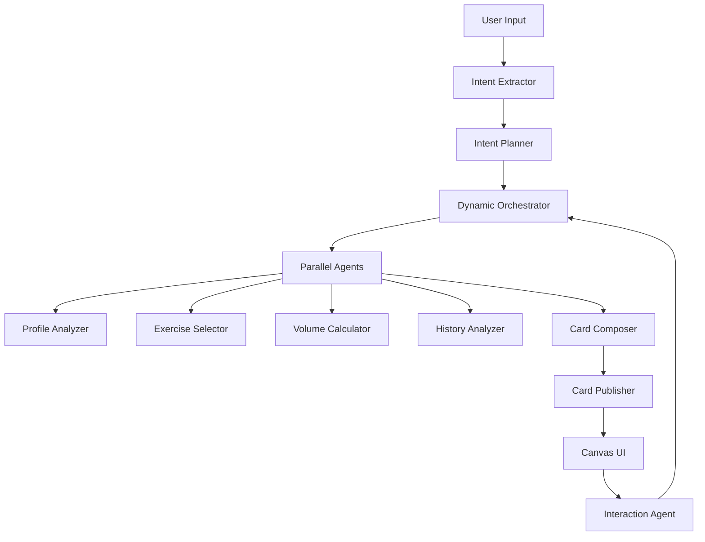

# Multi-Agent Canvas Orchestration Architecture

## Overview
A dynamic, multi-agent system that separates concerns, maximizes parallelism, and provides rich user interactions while maintaining deterministic control where possible.

## Core Principles
1. **Separation of Concerns**: Each agent has a single, focused responsibility
2. **Deterministic Where Possible**: Use LLMs only for reasoning, not for formatting or routing
3. **Parallel Execution**: Run independent agents simultaneously
4. **Streaming First**: Every agent action should be streamable to the UI
5. **Fail Fast, Retry Smart**: Quick failures with intelligent recovery

## Agent Pipeline Architecture



## Agent Definitions

### 1. Intent Extractor (Lightweight LLM)
**Purpose**: Convert raw user input into structured intent
**Type**: LLM-based (Gemini Flash)
**Input**: Raw user message + context
**Output**: Structured intent JSON
```json
{
  "primary_intent": "create_workout",
  "scope": "single_session",
  "constraints": {
    "muscle_groups": ["upper_body"],
    "duration": null,
    "equipment": null
  },
  "ambiguities": ["exact_muscles", "experience_level"],
  "confidence": 0.85
}
```
**Streaming**: Intent classification steps

### 2. Intent Planner (Deterministic + LLM)
**Purpose**: Create execution plan based on intent
**Type**: Hybrid (rules + LLM for complex cases)
**Input**: Structured intent
**Output**: Execution plan with dependencies
```json
{
  "plan_id": "plan_123",
  "steps": [
    {
      "id": "s1",
      "agent": "ProfileAgent",
      "action": "get_user_capabilities",
      "depends_on": []
    },
    {
      "id": "s2",
      "agent": "ExerciseAgent",
      "action": "select_upper_body_exercises",
      "depends_on": ["s1"]
    }
  ],
  "required_cards": ["session_plan", "exercise_details"],
  "interaction_points": ["confirm_exercises", "adjust_volume"]
}
```
**Streaming**: Planning steps

### 3. Dynamic Orchestrator (Deterministic)
**Purpose**: Execute plan with parallel optimization
**Type**: Pure deterministic
**Responsibilities**:
- Dependency resolution
- Parallel execution management
- Result aggregation
- Error recovery
- Stream coordination

**Streaming**: Orchestration status
```json
{
  "type": "orchestration",
  "status": "executing",
  "parallel_agents": ["ProfileAgent", "HistoryAgent"],
  "waiting_for": [],
  "completed": ["IntentExtractor"]
}
```

### 4. Specialized Execution Agents

#### ProfileAgent
**Purpose**: Analyze user profile and capabilities
**Type**: Deterministic (Firestore queries)
**Tools**: `get_user_preferences`, `get_injury_history`, `get_equipment_access`
**Streaming**: Profile facts found

#### ExerciseAgent
**Purpose**: Select appropriate exercises
**Type**: LLM-based (exercise reasoning)
**Tools**: `search_exercises`, `get_exercise_details`, `check_prerequisites`
**Streaming**: Exercise selection reasoning

#### VolumeAgent
**Purpose**: Calculate sets, reps, and intensity
**Type**: Hybrid (rules + LLM for personalization)
**Tools**: `calculate_volume`, `adjust_for_experience`, `apply_progression`
**Streaming**: Volume calculations

#### HistoryAgent
**Purpose**: Analyze workout history
**Type**: Deterministic (analytics)
**Tools**: `get_recent_workouts`, `calculate_volume_trends`, `identify_gaps`
**Streaming**: Historical insights

### 5. Card Composer (LLM)
**Purpose**: Transform data into card specifications
**Type**: LLM-based (presentation logic)
**Input**: Aggregated agent results
**Output**: Card specifications
```json
{
  "cards": [
    {
      "type": "agent-message",
      "content": {
        "text": "I've designed an upper body workout...",
        "status": "complete"
      }
    },
    {
      "type": "session-plan",
      "content": {
        "title": "Upper Body Focus",
        "exercises": [...]
      }
    }
  ]
}
```
**Streaming**: Card generation status

### 6. Card Publisher (Deterministic)
**Purpose**: Validate and publish cards to Firestore
**Type**: Pure deterministic
**Responsibilities**:
- Schema validation
- Deduplication
- Batch optimization
- Firestore writes

### 7. Interaction Agent (LLM)
**Purpose**: Handle user interactions with cards
**Type**: LLM-based
**Handles**:
- Card acceptance/rejection
- Regeneration requests
- Clarifying questions
- Context updates

## Streaming Architecture

### Stream Types
1. **Agent Status Stream**: What the agent is doing
2. **Thinking Stream**: LLM reasoning (collapsible)
3. **Tool Stream**: Tool calls and results
4. **Card Stream**: Generated cards
5. **Interaction Stream**: User actions

### Stream Message Format
```typescript
interface StreamMessage {
  type: 'status' | 'thinking' | 'tool' | 'card' | 'interaction';
  agent: string;
  timestamp: number;
  content: {
    // Type-specific content
  };
  metadata: {
    correlation_id: string;
    parent_id?: string;
    is_background?: boolean;
  };
}
```

## Implementation Strategy

### Phase 1: Core Pipeline (Week 1)
1. Intent Extractor
2. Intent Planner
3. Dynamic Orchestrator
4. Basic streaming

### Phase 2: Execution Agents (Week 2)
1. ProfileAgent (deterministic)
2. ExerciseAgent (LLM)
3. Card Composer
4. Card Publisher

### Phase 3: Advanced Features (Week 3)
1. VolumeAgent
2. HistoryAgent
3. Interaction Agent
4. Rich streaming UI

### Phase 4: Optimization (Week 4)
1. Parallel execution optimization
2. Caching layer
3. Error recovery
4. A/B testing framework

## Technology Choices

### Agent Framework
- **ADK (Agent Development Kit)** for LLM agents
- **Cloud Functions** for deterministic agents
- **Pub/Sub** for inter-agent communication

### Models
- **Gemini Flash**: Intent extraction, quick decisions
- **Gemini Pro**: Complex reasoning, exercise selection
- **Claude Haiku**: Card composition (if needed)

### Streaming
- **SSE (Server-Sent Events)** for real-time updates
- **Firestore listeners** for card updates
- **WebSockets** for bidirectional interaction (future)

## Example Flow

### User: "I want to plan a workout to really hit my upper body"

1. **Intent Extractor** (100ms)
   ```
   Stream: "Understanding your request..."
   Output: {intent: "create_workout", scope: "upper_body"}
   ```

2. **Intent Planner** (200ms)
   ```
   Stream: "Planning workout structure..."
   Output: {steps: [...], parallel: ["profile", "history"]}
   ```

3. **Dynamic Orchestrator** (orchestrates parallel execution)
   ```
   Stream: "Checking your profile and history..."
   Parallel:
     - ProfileAgent: Gets user capabilities
     - HistoryAgent: Analyzes recent workouts
   ```

4. **ExerciseAgent** (500ms)
   ```
   Stream: "Selecting exercises for chest, shoulders, and arms..."
   Output: [benchPress, shoulderPress, bicepCurls, ...]
   ```

5. **VolumeAgent** (300ms)
   ```
   Stream: "Calculating sets and reps..."
   Output: {sets: 3, reps: 8-12, intensity: "moderate"}
   ```

6. **Card Composer** (200ms)
   ```
   Stream: "Preparing your workout..."
   Output: [agentMessage, sessionPlan, exerciseCards]
   ```

7. **Card Publisher** (100ms)
   ```
   Stream: [Cards appear in UI]
   ```

**Total Time**: ~1.4 seconds (vs 30+ seconds currently)

## Benefits

1. **Speed**: Parallel execution reduces latency by 5-10x
2. **Reliability**: Isolated agents fail independently
3. **Debuggability**: Clear agent boundaries and logs
4. **Scalability**: Add new agents without affecting others
5. **User Experience**: Rich streaming shows progress
6. **Flexibility**: Easy to A/B test different agents

## Migration Path

1. **Keep current single agent** as fallback
2. **Implement Intent Extractor** first
3. **Add agents incrementally** behind feature flags
4. **Monitor performance** and quality metrics
5. **Gradual rollout** with user segments

## Success Metrics

- **Latency**: < 2 seconds for workout generation
- **Quality**: 90%+ user acceptance rate
- **Reliability**: 99.9% success rate
- **Engagement**: 2x interaction rate with cards
- **Development Velocity**: 50% faster feature development
