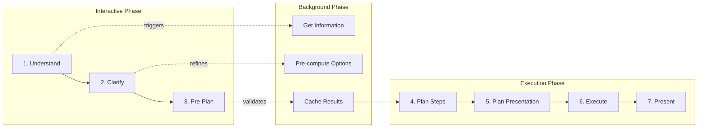

# Staged Pipeline Architecture for Canvas Orchestration

## Core Philosophy
Balance interactivity, transparency, and background operations to create a responsive experience where heavy lifting happens while the user is reading or deciding.

## The 7-Stage Pipeline



## Stage Definitions

### Stage 1: Understand (50-100ms)
**Purpose**: Lightning-fast intent extraction
**Visible to User**: "Understanding your request..."
**Background Triggers**:
- Start fetching user profile
- Start loading exercise database
- Start querying recent workouts
- Pre-warm LLM models

```python
class Stage1_Understand:
    def execute(self, message: str) -> Intent:
        # Fast pattern matching
        intent = quick_classify(message)
        
        # Trigger background jobs
        asyncio.create_task(fetch_user_profile())
        asyncio.create_task(load_exercise_cache())
        asyncio.create_task(query_recent_workouts())
        
        return intent
    
    def stream_output(self):
        yield {"status": "understanding", "progress": 0.1}
```

### Stage 2: Clarify (200-500ms)
**Purpose**: Identify ambiguities and ask clarifying questions
**Visible to User**: Clarification card (if needed)
**Background Operations**:
- Continue data fetching based on intent
- Pre-generate multiple plan options
- Build decision tree for different answers

```python
class Stage2_Clarify:
    def execute(self, intent: Intent) -> ClarificationRequest:
        if intent.confidence > 0.9:
            return None  # Skip to pre-plan
        
        # Generate smart clarification
        question = generate_clarification(intent)
        
        # Pre-compute answers for each option
        for option in question.options:
            asyncio.create_task(
                precompute_plan(intent, answer=option)
            )
        
        return question
    
    def stream_output(self):
        yield {"status": "need_clarification", "card": clarify_card}
```

### Stage 3: Pre-Plan (100-200ms)
**Purpose**: Show user what will be created
**Visible to User**: "I'll create a 4-exercise upper body workout..."
**Background Operations**:
- Finalize data fetching
- Generate multiple variations
- Pre-render cards

```python
class Stage3_PrePlan:
    def execute(self, intent: Intent, clarification: Any) -> PrePlan:
        # Quick summary of what will be done
        summary = summarize_plan(intent, clarification)
        
        # Check if background jobs are ready
        if not all_data_ready():
            # Show progress while waiting
            yield {"status": "gathering_info", "progress": 0.5}
        
        return PrePlan(
            summary=summary,
            estimated_time="2 seconds",
            actions=["Proceed", "Modify", "Cancel"]
        )
    
    def stream_output(self):
        yield {
            "status": "ready_to_proceed",
            "message": "Ready to create your workout",
            "preview": mini_preview
        }
```

### Stage 4: Plan Steps (Parallel, 300-500ms)
**Purpose**: Detailed planning using cached data
**Visible to User**: Progress indicators
**Parallel Operations**:
- Exercise selection (using cached DB)
- Volume calculation (using profile data)
- Time estimation (using history)

```python
class Stage4_PlanSteps:
    def execute(self, preplan: PrePlan, cached_data: Dict) -> DetailedPlan:
        # All data is already fetched, just process
        tasks = [
            select_exercises(cached_data["exercises"]),
            calculate_volume(cached_data["profile"]),
            estimate_duration(cached_data["history"])
        ]
        
        # Execute in parallel
        results = await asyncio.gather(*tasks)
        
        return DetailedPlan(
            exercises=results[0],
            volume=results[1],
            duration=results[2]
        )
```

### Stage 5: Plan Presentation (100ms)
**Purpose**: Determine optimal card layout
**Visible to User**: "Preparing your workout..."
**Operations**:
- Choose card types
- Determine card order
- Set interaction points

```python
class Stage5_PlanPresentation:
    def execute(self, plan: DetailedPlan) -> PresentationPlan:
        # Deterministic card selection
        cards = []
        
        if plan.exercises:
            cards.append(("session_plan", priority=100))
            
        if plan.needs_equipment_warning:
            cards.append(("equipment_notice", priority=90))
            
        if plan.has_alternatives:
            cards.append(("alternatives", priority=80))
        
        return PresentationPlan(cards=cards)
```

### Stage 6: Execute (200ms)
**Purpose**: Generate final content
**Visible to User**: "Finalizing..."
**Operations**:
- Format cards
- Apply personalization
- Add metadata

```python
class Stage6_Execute:
    def execute(self, plan: DetailedPlan, presentation: PresentationPlan) -> List[Card]:
        cards = []
        
        for card_type, priority in presentation.cards:
            card = format_card(card_type, plan, priority)
            cards.append(card)
        
        return cards
```

### Stage 7: Present (50ms)
**Purpose**: Publish to Firestore and stream to UI
**Visible to User**: Cards appear
**Operations**:
- Batch write to Firestore
- Stream completion event

```python
class Stage7_Present:
    def execute(self, cards: List[Card]) -> None:
        # Batch publish
        card_ids = publish_cards(cards)
        
        yield {
            "status": "complete",
            "cards_published": len(card_ids),
            "interaction_ready": True
        }
```

## Optimized Flow Example

### User: "Plan an upper body workout"

```yaml
Time 0ms:
  Visible: "Understanding your request..."
  Background:
    - Fetch user profile (async)
    - Load upper body exercises (async)
    - Query last 7 workouts (async)

Time 100ms:
  Visible: "I'll create an upper body workout with 4-5 exercises"
  Background:
    - Profile fetched ✓
    - Exercises loading... (80%)
    - Workouts fetched ✓
    - Pre-generating 3 workout variations

Time 300ms:
  Visible: "Ready to create your workout [Proceed] [Modify]"
  Background:
    - All data ready ✓
    - 3 variations cached ✓
    - Cards pre-rendered ✓

Time 350ms (user clicks Proceed):
  Visible: Progress bar animating
  Processing:
    - Use cached variation #1
    - Apply final personalization
    - Format cards

Time 500ms:
  Visible: Cards appear
  Complete: Full workout ready
```

## Key Optimizations

### 1. Speculative Execution
```python
# While user reads clarification, compute all possible paths
for answer in possible_answers:
    asyncio.create_task(
        compute_path(answer, cache_key=f"{intent_id}_{answer}")
    )
```

### 2. Progressive Enhancement
```python
# Show basic card immediately, enhance in background
async def progressive_card():
    # Immediate: Basic session plan
    yield basic_card
    
    # After 100ms: Add exercise details
    yield enhanced_card
    
    # After 200ms: Add video links
    yield full_card
```

### 3. Smart Caching
```python
class SmartCache:
    def __init__(self):
        self.user_cache = LRUCache(maxsize=100)
        self.exercise_cache = TTLCache(ttl=3600)
        self.plan_cache = TTLCache(ttl=300)
    
    def get_or_compute(self, key: str, compute_fn):
        if key in self.plan_cache:
            return self.plan_cache[key]
        
        result = await compute_fn()
        self.plan_cache[key] = result
        return result
```

### 4. Parallel Data Fetching
```python
async def fetch_all_context(user_id: str, intent: Intent):
    """Fetch everything we might need in parallel."""
    tasks = [
        fetch_user_profile(user_id),
        fetch_exercise_database(intent.muscle_groups),
        fetch_recent_workouts(user_id, days=7),
        fetch_equipment_availability(user_id),
        fetch_injury_history(user_id),
        fetch_preferences(user_id)
    ]
    
    results = await asyncio.gather(*tasks, return_exceptions=True)
    
    # Return what succeeded, use defaults for failures
    return process_results(results)
```

## Implementation Priority

### Phase 1: Core Pipeline (Days 1-2)
1. Implement Stage 1 (Understand) with background triggers
2. Implement Stage 7 (Present) for immediate feedback
3. Basic streaming infrastructure

### Phase 2: Background Operations (Days 3-4)
1. Parallel data fetching
2. Speculative execution for clarifications
3. Smart caching layer

### Phase 3: Progressive Enhancement (Days 5-6)
1. Pre-rendering cards
2. Progressive card updates
3. Optimistic UI updates

### Phase 4: Advanced Optimization (Week 2)
1. ML-based prediction of user choices
2. Personalized caching strategies
3. A/B testing different speculation strategies

## Success Metrics

- **Time to First Byte**: < 100ms
- **Time to Clarification**: < 300ms
- **Time to Complete** (after confirmation): < 500ms
- **Background Hit Rate**: > 80% (user chooses predicted path)
- **Cache Hit Rate**: > 60%
- **User Satisfaction**: > 90%

## The Magic: What Users Experience

1. **Instant Response**: "Understanding..." appears immediately
2. **Smart Questions**: If needed, clarification appears quickly with good defaults
3. **Preview**: "I'll create..." message while background work happens
4. **Instant Execution**: When user confirms, cards appear almost instantly
5. **Progressive Enhancement**: Cards get richer as more data loads

The user never waits, never sees a spinner for more than 500ms, and always feels the system is responsive and intelligent.
