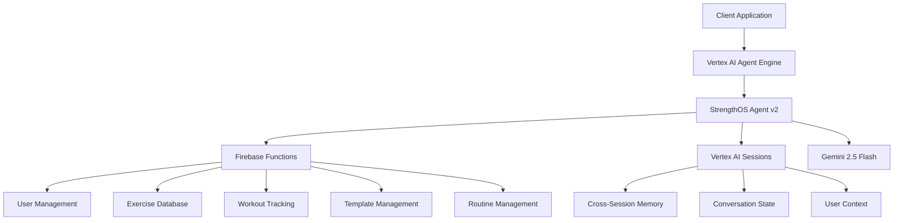
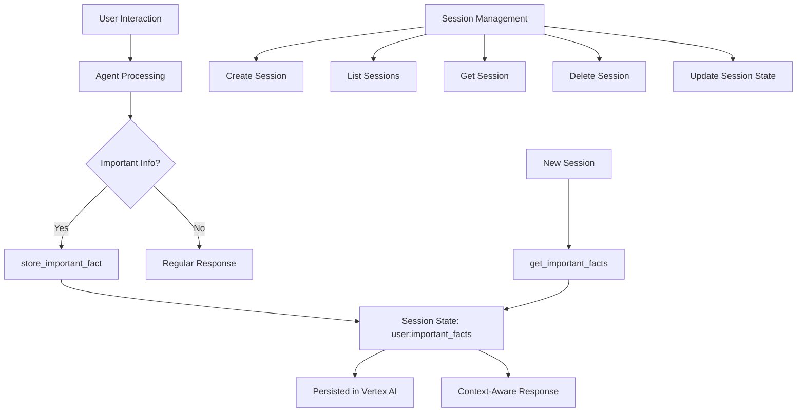

# StrengthOS Agent v2

AI-powered fitness assistant built with Google Agent Development Kit (ADK) and deployed on Vertex AI Agent Engine. Features 20 Firebase-backed tools for personalized workout management with cross-session memory persistence.

---

## Table of Contents

1. [Internal Documentation](#internal-documentation)
   - [Architecture Overview](#architecture-overview)
   - [Core Components](#core-components)
   - [Memory Architecture](#memory-architecture)
   - [Agent Capabilities](#agent-capabilities)
   - [Development Environment](#development-environment)
   - [Deployment Pipeline](#deployment-pipeline)
   - [Troubleshooting](#troubleshooting)

2. [External Documentation](#external-documentation)
   - [Integration Overview](#integration-overview)
   - [Authentication](#authentication)
   - [API Endpoints](#api-endpoints)
   - [Session Management](#session-management)
   - [Response Formats](#response-formats)
   - [Client SDKs](#client-sdks)
   - [Error Handling](#error-handling)

---

# Internal Documentation

This section serves as comprehensive internal documentation for developers working on the StrengthOS Agent system. It covers architecture, implementation details, and development workflows.

## Architecture Overview

### System Architecture



### Core Components

```
strengthos-v2/
├── app/
│   ├── strengthos_agent.py    # Main agent with 20 Firebase tools
│   ├── agent_engine_app.py    # Deployment wrapper for Vertex AI
│   ├── agent.py              # Agent export
│   └── utils/                # Utilities (GCS, tracing, typing)
├── interactive_chat.py        # Testing interface (deployed agent)
├── local_chat_with_sessions.py # Local testing with full session support
├── deployment_metadata.json   # Current deployment information
├── agent_engine_requirements.txt # Minimal deployment dependencies
└── notebooks/                # Development and testing notebooks
```

### Technology Stack

- **Agent Framework**: Google Agent Development Kit (ADK) 1.0.0+
- **Deployment Platform**: Vertex AI Agent Engine
- **Language Model**: Gemini 2.5 Flash
- **Backend Services**: Firebase Functions
- **Session Management**: Vertex AI Agent Engine Sessions
- **Memory Storage**: Vertex AI managed sessions
- **Development Tools**: Python 3.9-3.12, UV package manager

## Memory Architecture

The agent uses **Vertex AI Agent Engine Sessions** for sophisticated cross-session memory management:



**Memory Features:**
- ✅ Cross-session persistence for injuries, limitations, goals
- ✅ User-isolated memory spaces with 128-character user ID limit
- ✅ Automatic state management via Vertex AI
- ✅ Event-based session updates with timestamps
- ✅ State delta management for efficient updates
- ✅ No external memory services required

## Agent Capabilities

**20 Firebase Tools** organized in 6 functional categories:

### 1. User Management (2 tools)
- `get_user(user_id)` - Retrieve user profile, preferences, and statistics
- `update_user(user_id, updates)` - Update user information and preferences

### 2. Exercise Database (3 tools)
- `list_exercises(muscle_group, equipment, difficulty, limit)` - Browse 1300+ exercises
- `search_exercises(query, muscle_groups, equipment, movement_type, level)` - Advanced semantic search
- `get_exercise(exercise_id)` - Detailed exercise information with instructions

### 3. Workout Tracking (2 tools)
- `get_user_workouts(user_id, limit, start_date, end_date)` - Historical workout data
- `get_workout(workout_id, user_id)` - Specific workout details and analytics

### 4. Template Management (5 tools)
- `get_user_templates(user_id)` - List user's workout templates
- `get_template(template_id, user_id)` - Template details and exercises
- `create_template(user_id, name, description, exercises)` - Create new templates
- `update_template(template_id, user_id, updates)` - Modify existing templates
- `delete_template(template_id, user_id)` - Remove templates

### 5. Routine Management (7 tools)
- `get_user_routines(user_id)` - List training routines
- `get_active_routine(user_id)` - Current active routine
- `get_routine(routine_id, user_id)` - Routine details and schedule
- `create_routine(user_id, name, description, frequency, template_ids)` - Create routines
- `update_routine(routine_id, user_id, name, description, frequency)` - Modify routines
- `delete_routine(routine_id, user_id)` - Remove routines
- `set_active_routine(user_id, routine_id)` - Activate routine

### 6. Memory Management (2 tools)
- `store_important_fact(fact, category)` - Store critical user information
- `get_important_facts()` - Retrieve stored facts (injuries, limitations, preferences)

## Development Environment

### Current Deployment Configuration
- **Agent ID**: `4683295011721183232`
- **Full Resource Name**: `projects/919326069447/locations/us-central1/reasoningEngines/4683295011721183232`
- **Model**: Gemini 2.5 Flash
- **Location**: us-central1 (only supported region for Agent Engine Sessions)
- **Project**: myon-53d85

### Local Development Setup

#### Prerequisites
```bash
# Authenticate with Google Cloud
gcloud auth application-default login

# Install dependencies
uv sync

# Verify Python version (3.9-3.12 required)
python --version
```

#### Environment Variables
```bash
export GOOGLE_CLOUD_PROJECT="myon-53d85"
export FIREBASE_API_KEY="your-firebase-key"  # For Firebase tools
export GOOGLE_CLOUD_AGENT_ENGINE_ID="4683295011721183232"  # For deployed testing
```

#### Testing Options

**1. Interactive Chat (Deployed Agent) ⚡**
```bash
uv run interactive_chat.py --engine-id 4683295011721183232
```
- Tests deployed agent via Vertex AI API
- Full session support with cross-conversation memory
- Production-ready performance testing

**2. Local Development (Full ADK Runner) 🔧**
```bash
uv run local_chat_with_sessions.py
```
- Runs agent locally with ADK Runner
- Full session management and state inspection
- Development and debugging features
- Hot reloading for rapid iteration

**3. ADK Web Interface**
```bash
adk web --session_db_url=agentengine://4683295011721183232
```
- Browser-based testing interface
- Visual session management
- Real-time conversation debugging

## Deployment Pipeline

### Deploy Updates to Production
```bash
# Deploy to Vertex AI Agent Engine
uv run app/agent_engine_app.py \
  --project myon-53d85 \
  --location us-central1 \
  --agent-name strengthos-v2 \
  --requirements-file agent_engine_requirements.txt
```

### Adding New Tools

1. **Define the function** in `app/strengthos_agent.py`:
```python
def new_tool(param: str, tool_context: ToolContext) -> str:
    """Tool description for the LLM.
    
    Args:
        param: Description of parameter
        tool_context: ADK tool context
        
    Returns:
        str: Result description
    """
    # Implementation
    return result
```

2. **Add to tools list**:
```python
tools = [
    # ... existing tools
    FunctionTool(func=new_tool),
]
```

3. **Test locally**:
```bash
uv run local_chat_with_sessions.py
```

4. **Deploy**:
```bash
uv run app/agent_engine_app.py --project myon-53d85 --location us-central1 --agent-name strengthos-v2 --requirements-file agent_engine_requirements.txt
```

## Troubleshooting

### Common Development Issues

**Memory not persisting across sessions:**
- Ensure using the same `userId` across sessions (max 128 characters)
- Check that `sessionId` is different for new conversations
- Verify deployment has latest memory implementation
- Test with `get_important_facts()` to verify storage

**Agent not responding locally:**
- Check ADK version: `pip show google-cloud-aiplatform`
- Verify authentication: `gcloud auth application-default login`
- Check environment variables are set correctly
- Test with minimal agent first

**Firebase tools failing:**
- Ensure `FIREBASE_API_KEY` environment variable is set
- Check Firebase function deployment status in console
- Verify user permissions in Firebase Auth
- Test individual Firebase functions directly

**Deployment failures:**
- Check deployment logs: `gcloud logging read 'resource.labels.reasoning_engine_id="4683295011721183232"' --limit=50`
- Verify project permissions and quotas
- Ensure requirements.txt includes all dependencies
- Check Agent Engine service availability

### Monitoring and Logging

```bash
# View deployment logs
gcloud logging read 'resource.labels.reasoning_engine_id="4683295011721183232"' --limit=50

# Monitor agent performance
gcloud ai reasoning-engines describe 4683295011721183232 --location=us-central1

# List all deployed agents
gcloud ai reasoning-engines list --location=us-central1
```

---

# External Documentation

This section provides comprehensive integration documentation for external developers building applications that interact with the StrengthOS Agent system.

## Integration Overview

The StrengthOS Agent v2 is deployed on Google Cloud Vertex AI Agent Engine and provides a REST API for building fitness applications. The agent combines conversational AI with 20 specialized fitness tools and cross-session memory management.

### Key Integration Features
- **Conversational Interface**: Natural language interaction with fitness expertise
- **Session Management**: Persistent conversations with memory across sessions
- **Firebase Integration**: Access to comprehensive fitness database (1300+ exercises)
- **Memory Persistence**: Automatic storage of user preferences, injuries, and limitations
- **Streaming Responses**: Real-time response streaming for better UX
- **Multi-platform Support**: REST API compatible with any HTTP client

## Authentication

The agent uses **Google Cloud Application Default Credentials** for authentication. Choose the appropriate method for your application:

### Option 1: Service Account Key (Recommended for Mobile Apps)
```swift
// Use Firebase Auth or Google Sign-In SDK
// Exchange for Agent Engine access token
let credential = GoogleAuthProvider.credential(withIDToken: idToken, accessToken: accessToken)
```

### Option 2: API Key (If Configured)
```swift
// Add to request headers
"X-API-Key": "your-api-key"
```

### Option 3: OAuth 2.0 (Web Applications)
```javascript
// Use Google OAuth 2.0 flow
const token = await getAccessToken();
headers['Authorization'] = `Bearer ${token}`;
```

## API Endpoints

### Base Configuration

```swift
let projectId = "919326069447"
let location = "us-central1"
let agentId = "4683295011721183232"
let baseURL = "https://\(location)-aiplatform.googleapis.com/v1/projects/\(projectId)/locations/\(location)/reasoningEngines/\(agentId)"
```

### Core Endpoints

#### 1. Stream Query (Primary Interaction)
**Endpoint**: `POST /{baseURL}:streamQuery`

**Purpose**: Send messages to the agent and receive streaming responses

**Request Body**:
```json
{
  "message": "What's a good workout for building chest muscles?",
  "userId": "user_123",
  "sessionId": "session_456"
}
```

**Response**: Server-Sent Events (SSE) stream of JSON chunks

#### 2. Query (Non-Streaming)
**Endpoint**: `POST /{baseURL}:query`

**Purpose**: Send messages and receive complete response

**Request Body**:
```json
{
  "message": "Show me my workout history",
  "userId": "user_123",
  "sessionId": "session_456"
}
```

## Session Management

The StrengthOS Agent provides comprehensive session management capabilities through Vertex AI Agent Engine Sessions. Sessions maintain conversation context, user preferences, and memory across interactions.

### Core Session Concepts

- **Session**: Chronological sequence of messages and actions for a single conversation
- **Event**: Individual message or action within a session (with timestamps)
- **State**: Temporary data relevant to the current conversation
- **Memory**: Persistent information accessible across multiple sessions for a user

### Session Management Functions

#### 1. Create Session
**Endpoint**: `POST /{baseURL}:createSession`

**Purpose**: Start a new conversation session for a user

```swift
struct CreateSessionRequest: Codable {
    let userId: String
    let initialState: [String: Any]? // Optional initial state
}

func createSession(userId: String, initialState: [String: Any]? = nil) async throws -> Session {
    let url = URL(string: "\(baseURL):createSession")!
    var request = URLRequest(url: url)
    request.httpMethod = "POST"
    request.setValue("application/json", forHTTPHeaderField: "Content-Type")
    
    let body = CreateSessionRequest(userId: userId, initialState: initialState)
    request.httpBody = try JSONEncoder().encode(body)
    
    let (data, _) = try await URLSession.shared.data(for: request)
    return try JSONDecoder().decode(Session.self, from: data)
}
```

**Response**:
```json
{
  "id": "7543472750996750336",
  "app_name": "7917477678498709504",
  "user_id": "user_123",
  "state": {},
  "events": [],
  "last_update_time": 1743683353.030133
}
```

#### 2. List Sessions
**Endpoint**: `GET /{baseURL}:listSessions`

**Purpose**: Retrieve all sessions for a specific user

```swift
func listSessions(userId: String) async throws -> [String] {
    let url = URL(string: "\(baseURL):listSessions?userId=\(userId)")!
    var request = URLRequest(url: url)
    request.httpMethod = "GET"
    
    let (data, _) = try await URLSession.shared.data(for: request)
    let response = try JSONDecoder().decode(ListSessionsResponse.self, from: data)
    return response.sessionIds
}
```

**Response**:
```json
{
  "session_ids": ["7543472750996750336", "8654573861107861447"]
}
```

#### 3. Get Session
**Endpoint**: `GET /{baseURL}:getSession`

**Purpose**: Retrieve details of a specific session

```swift
func getSession(userId: String, sessionId: String) async throws -> Session {
    let url = URL(string: "\(baseURL):getSession?userId=\(userId)&sessionId=\(sessionId)")!
    var request = URLRequest(url: url)
    request.httpMethod = "GET"
    
    let (data, _) = try await URLSession.shared.data(for: request)
    return try JSONDecoder().decode(Session.self, from: data)
}
```

#### 4. Delete Session
**Endpoint**: `DELETE /{baseURL}:deleteSession`

**Purpose**: Remove a session and all its associated data

```swift
func deleteSession(userId: String, sessionId: String) async throws {
    let url = URL(string: "\(baseURL):deleteSession")!
    var request = URLRequest(url: url)
    request.httpMethod = "DELETE"
    request.setValue("application/json", forHTTPHeaderField: "Content-Type")
    
    let body = ["userId": userId, "sessionId": sessionId]
    request.httpBody = try JSONSerialization.data(withJSONObject: body)
    
    let (_, response) = try await URLSession.shared.data(for: request)
    guard let httpResponse = response as? HTTPURLResponse, httpResponse.statusCode == 200 else {
        throw APIError.deletionFailed
    }
}
```

#### 5. Update Session State
**Endpoint**: `POST /{baseURL}:updateSessionState`

**Purpose**: Modify session state outside of conversation flow

```swift
func updateSessionState(userId: String, sessionId: String, stateDelta: [String: Any]) async throws {
    let url = URL(string: "\(baseURL):updateSessionState")!
    var request = URLRequest(url: url)
    request.httpMethod = "POST"
    request.setValue("application/json", forHTTPHeaderField: "Content-Type")
    
    let body = [
        "userId": userId,
        "sessionId": sessionId,
        "stateDelta": stateDelta
    ]
    request.httpBody = try JSONSerialization.data(withJSONObject: body)
    
    let (_, _) = try await URLSession.shared.data(for: request)
}
```

#### 6. Append Event
**Endpoint**: `POST /{baseURL}:appendEvent`

**Purpose**: Add custom events to a session (for system events, logging, etc.)

```swift
func appendEvent(userId: String, sessionId: String, event: SessionEvent) async throws {
    let url = URL(string: "\(baseURL):appendEvent")!
    var request = URLRequest(url: url)
    request.httpMethod = "POST"
    request.setValue("application/json", forHTTPHeaderField: "Content-Type")
    
    let body = [
        "userId": userId,
        "sessionId": sessionId,
        "event": event
    ]
    request.httpBody = try JSONSerialization.data(withJSONObject: body)
    
    let (_, _) = try await URLSession.shared.data(for: request)
}
```

### Session Best Practices

1. **User ID Management**: Use consistent, unique user IDs (max 128 characters)
2. **Session Lifecycle**: Create new sessions for distinct conversations
3. **Memory Persistence**: Let the agent automatically manage important facts
4. **State Management**: Use session state for temporary conversation data
5. **Cleanup**: Delete old sessions to manage storage costs
6. **Error Handling**: Implement retry logic for session operations

## Response Formats

### Streaming Response Format

Agent responses come as Server-Sent Events (SSE) with JSON chunks:

```swift
struct AgentResponse: Codable {
    let content: Content?
    let author: String
    let timestamp: Double
    let id: String
    let invocationId: String
    let actions: Actions?
}

struct Content: Codable {
    let parts: [Part]
    let role: String
}

struct Part: Codable {
    let text: String?
    let functionCall: FunctionCall?
    let functionResponse: FunctionResponse?
}

struct Actions: Codable {
    let stateDelta: [String: Any]?
    let artifactDelta: [String: Any]?
    let requestedAuthConfigs: [String: Any]?
}
```

### Function Call Format

When the agent uses tools, you'll see function calls in the response:

```json
{
  "content": {
    "parts": [{
      "function_call": {
        "id": "af-a33fedb0-29e6-4d0c-9eb3-00c402969395",
        "name": "get_user_workouts",
        "args": {
          "user_id": "user_123",
          "limit": 10
        }
      }
    }],
    "role": "model"
  },
  "author": "strengthos_agent"
}
```

### Error Response Format

```json
{
  "error": {
    "code": 400,
    "message": "Invalid session ID",
    "status": "INVALID_ARGUMENT",
    "details": [{
      "type": "BadRequest",
      "description": "Session not found for user"
    }]
  }
}
```

## Client SDKs

### Swift Implementation Example

```swift
class StrengthOSClient {
    private let baseURL: String
    private let session = URLSession.shared
    
    init(projectId: String = "919326069447", 
         location: String = "us-central1", 
         agentId: String = "4683295011721183232") {
        self.baseURL = "https://\(location)-aiplatform.googleapis.com/v1/projects/\(projectId)/locations/\(location)/reasoningEngines/\(agentId)"
    }
    
    func streamQuery(message: String, userId: String, sessionId: String? = nil) -> AsyncThrowingStream<AgentResponse, Error> {
        return AsyncThrowingStream { continuation in
            Task {
                do {
                    let url = URL(string: "\(baseURL):streamQuery")!
                    var request = URLRequest(url: url)
                    request.httpMethod = "POST"
                    request.setValue("application/json", forHTTPHeaderField: "Content-Type")
                    
                    let body = StreamQueryRequest(
                        message: message,
                        userId: userId,
                        sessionId: sessionId ?? UUID().uuidString
                    )
                    request.httpBody = try JSONEncoder().encode(body)
                    
                    let (data, _) = try await session.data(for: request)
                    // Parse SSE stream and yield responses
                    // Implementation details for SSE parsing...
                    
                } catch {
                    continuation.finish(throwing: error)
                }
            }
        }
    }
}
```

### JavaScript/TypeScript Implementation

```typescript
class StrengthOSClient {
  private baseURL: string;
  
  constructor(
    projectId: string = "919326069447",
    location: string = "us-central1", 
    agentId: string = "4683295011721183232"
  ) {
    this.baseURL = `https://${location}-aiplatform.googleapis.com/v1/projects/${projectId}/locations/${location}/reasoningEngines/${agentId}`;
  }
  
  async* streamQuery(message: string, userId: string, sessionId?: string): AsyncGenerator<AgentResponse> {
    const response = await fetch(`${this.baseURL}:streamQuery`, {
      method: 'POST',
      headers: {
        'Content-Type': 'application/json',
        'Authorization': `Bearer ${await this.getAccessToken()}`
      },
      body: JSON.stringify({
        message,
        userId,
        sessionId: sessionId || generateUUID()
      })
    });
    
    const reader = response.body?.getReader();
    if (!reader) throw new Error('No response body');
    
    while (true) {
      const { done, value } = await reader.read();
      if (done) break;
      
      const chunk = new TextDecoder().decode(value);
      const lines = chunk.split('\n');
      
      for (const line of lines) {
        if (line.startsWith('data: ')) {
          const data = JSON.parse(line.slice(6));
          yield data as AgentResponse;
        }
      }
    }
  }
}
```

## Error Handling

### Common Error Codes

| Code | Status | Description | Resolution |
|------|--------|-------------|------------|
| 400 | INVALID_ARGUMENT | Invalid request parameters | Check request format and required fields |
| 401 | UNAUTHENTICATED | Authentication failed | Verify credentials and tokens |
| 403 | PERMISSION_DENIED | Insufficient permissions | Check IAM roles and project access |
| 404 | NOT_FOUND | Session or resource not found | Verify session ID and user ID |
| 429 | RESOURCE_EXHAUSTED | Rate limit exceeded | Implement exponential backoff |
| 500 | INTERNAL | Server error | Retry with exponential backoff |
| 503 | UNAVAILABLE | Service temporarily unavailable | Retry after delay |

### Error Handling Best Practices

```swift
func handleAPIError(_ error: Error) -> UserFriendlyError {
    if let apiError = error as? APIError {
        switch apiError.code {
        case 401:
            return .authenticationRequired
        case 404:
            return .sessionNotFound
        case 429:
            return .rateLimited
        case 500, 503:
            return .serverError
        default:
            return .unknownError
        }
    }
    return .networkError
}

// Implement retry logic
func withRetry<T>(maxAttempts: Int = 3, operation: @escaping () async throws -> T) async throws -> T {
    var lastError: Error?
    
    for attempt in 1...maxAttempts {
        do {
            return try await operation()
        } catch {
            lastError = error
            if attempt < maxAttempts {
                let delay = min(pow(2.0, Double(attempt)), 30.0) // Exponential backoff, max 30s
                try await Task.sleep(nanoseconds: UInt64(delay * 1_000_000_000))
            }
        }
    }
    
    throw lastError ?? APIError.maxRetriesExceeded
}
```

### Memory Integration

The agent automatically persists important information across sessions:

```swift
// When user mentions injuries/limitations, agent calls store_important_fact
// This persists across sessions for the same userId

// Example conversation flow:
// 1. User: "I have a shoulder injury"
// 2. Agent automatically stores this fact
// 3. Future sessions: Agent recalls and considers the injury

// No explicit memory management required from client side
// Agent handles memory storage and retrieval automatically
```

### Rate Limiting and Quotas

- **Requests per minute**: 60 per user
- **Concurrent sessions**: 10 per user
- **Session duration**: 24 hours maximum
- **Message size**: 32KB maximum
- **Session storage**: 1MB per session

Implement proper rate limiting in your client:

```swift
class RateLimiter {
    private let maxRequests: Int
    private let timeWindow: TimeInterval
    private var requests: [Date] = []
    
    func canMakeRequest() -> Bool {
        let now = Date()
        requests = requests.filter { now.timeIntervalSince($0) < timeWindow }
        return requests.count < maxRequests
    }
    
    func recordRequest() {
        requests.append(Date())
    }
}
```

---

## 📄 License

Copyright 2025 Google LLC. Licensed under the Apache License, Version 2.0.
