# Catalog Orchestrator Architecture

## Overview

The **Catalog Orchestrator** is an automated catalog curation system that maintains and enriches the exercise catalog. It runs as a set of Cloud Run Jobs triggered on schedule, performing:

1. **Quality Audits** - Detecting exercises with missing/invalid fields
2. **Gap Analysis** - Finding missing equipment variants (e.g., "Squat (Kettlebell)" if missing)
3. **Enrichment** - Using LLM to populate missing fields intelligently
4. **Batch Processing** - Executing fix jobs safely with journaling

---

## System Data Flow

```mermaid
flowchart TB
    subgraph Trigger["⏰ Scheduled Trigger"]
        SCHEDULER[Cloud Scheduler]
    end

    subgraph Review["📋 Review Phase"]
        SCHEDULED[scheduled_review.py]
        REVIEWER[CatalogReviewer]
        GAP[FamilyGapAnalyzer]
        CREATOR[ReviewJobCreator]
    end

    subgraph Queue["📦 Job Queue (Firestore)"]
        JOBS[(catalog_jobs)]
        LOCKS[(catalog_locks)]
        IDEM[(catalog_idempotency)]
    end

    subgraph Execution["⚡ Execution Phase"]
        WORKER[CatalogWorker]
        EXECUTOR[JobExecutor]
        HANDLERS[Handlers]
    end

    subgraph Apply["✅ Apply Phase"]
        ENGINE[ApplyEngine]
        GATE[ValidationGate]
        JOURNAL[(catalog_changes)]
    end

    subgraph Data["🗄️ Catalog Data"]
        EXERCISES[(exercises collection)]
        ALIASES[(aliases collection)]
    end

    SCHEDULER --> SCHEDULED
    SCHEDULED --> REVIEWER
    SCHEDULED --> GAP
    REVIEWER --> CREATOR
    GAP --> CREATOR
    CREATOR --> JOBS
    CREATOR -.->|check| IDEM

    WORKER --> EXECUTOR
    EXECUTOR -->|dispatch| HANDLERS
    EXECUTOR -->|acquire| LOCKS
    JOBS --> WORKER

    HANDLERS --> ENGINE
    ENGINE --> GATE
    GATE -->|validate| ENGINE
    ENGINE --> JOURNAL
    ENGINE --> EXERCISES
    ENGINE --> ALIASES
```



---

## Component Details

### 1. Review Phase

#### scheduled_review.py
Entry point triggered by Cloud Scheduler. Orchestrates:
1. Fetches all exercises from catalog
2. Runs `CatalogReviewer.batch_review()` for quality issues
3. Runs `FamilyGapAnalyzer.analyze_family_gaps()` for missing variants
4. Creates jobs via `ReviewJobCreator`

#### CatalogReviewer
Performs deterministic quality checks:
- Missing `muscles_primary`
- Invalid `primary_equipment`
- Empty `description`
- Missing `family_slug`

Uses `WhatGoodLooksLike` exemplars to guide LLM fixes.

#### FamilyGapAnalyzer
Detects missing equipment variants using affinity maps:
```python
EQUIPMENT_AFFINITIES = {
    "squat": ["barbell", "dumbbell", "kettlebell", "smith_machine"],
    "curl": ["barbell", "dumbbell", "cable", "ez_bar"],
    ...
}
```

### 2. Job Queue

#### Job Model
```python
@dataclass
class Job:
    id: str
    type: JobType          # TARGETED_FIX, EXERCISE_ADD, etc.
    status: JobStatus      # queued, running, succeeded, failed
    payload: JobPayload    # family_slug, exercise_doc_ids, mode
    started_at: datetime   # When execution began
    lease_owner: str       # Worker ID holding the job
```

#### Job Types
| Type | Purpose |
|------|---------|
| `TARGETED_FIX` | Patch specific fields on exercises |
| `EXERCISE_ADD` | Create new exercise variants |
| `FAMILY_AUDIT` | Run quality checks on a family |
| `FAMILY_MERGE` | Combine two families |
| `FAMILY_SPLIT` | Divide a family by equipment |

### 3. Execution Phase

#### CatalogWorker
Long-running worker that:
1. Polls for available jobs
2. Acquires family-level locks
3. Dispatches to appropriate handler
4. Updates job status and run history


#### JobExecutor
Routes jobs to specific handlers:
```python
if job_type == JobType.TARGETED_FIX:
    return execute_targeted_fix(job_id, payload, mode)
elif job_type == JobType.EXERCISE_ADD:
    return execute_exercise_add(job_id, payload, mode)
...
```

### 4. Apply Phase

#### ApplyEngine
Executes `ChangePlan` operations:
1. Validates plan via `ValidationGate`
2. Acquires idempotency keys
3. Writes to `catalog_changes` journal
4. Mutates `exercises` collection

#### Mode Semantics
| Mode | Behavior |
|------|----------|
| `dry_run` | Validate plan, log what would change, no mutations |
| `apply` | Validate, journal, and execute mutations |

---

## Firestore Collections


---

## Enrichment System

The enrichment engine uses LLM to populate missing fields intelligently.

```mermaid
flowchart LR
    subgraph Input
        EX[Exercise Doc]
        GUIDE[ExerciseFieldGuide]
        EXEMPLARS[WhatGoodLooksLike]
    end

    subgraph LLM["🤖 LLM Processing"]
        PROMPT[Build Prompt]
        GEMINI[Gemini 2.5 Pro]
        PARSE[Parse Response]
    end

    subgraph Output
        PATCH[Field Patches]
        VALIDATE[Validators]
        APPLY[ApplyEngine]
    end

    EX --> PROMPT
    GUIDE --> PROMPT
    EXEMPLARS --> PROMPT
    PROMPT --> GEMINI
    GEMINI --> PARSE
    PARSE --> PATCH
    PATCH --> VALIDATE
    VALIDATE --> APPLY
```



### ExerciseFieldGuide
Defines field semantics, valid values, and naming conventions:
```python
FIELD_DEFINITIONS = {
    "muscles_primary": {
        "type": "array",
        "valid_values": ["chest", "back", "shoulders", ...],
        "description": "Primary muscles targeted"
    },
    ...
}
```

---

## Deployment

### Cloud Run Jobs

| Job | Schedule | Purpose |
|-----|----------|---------|
| `catalog-reviewer` | Daily 2 AM | Run scheduled_review.py |
| `catalog-worker` | On-demand | Process job queue |
| `catalog-watchdog` | Every 15 min | Recover stuck jobs |

### Environment Variables
```
FIRESTORE_PROJECT=myon-53d85
CATALOG_SHELL_MODEL=gemini-2.5-pro
APPLY_ENABLED=true
```

---

## Error Handling

### Retry Logic
Jobs have exponential backoff with jitter:
```python
def compute_backoff_seconds(attempts: int) -> int:
    base = 300  # 5 minutes
    delay = min(base * (2 ** attempts), 3600)  # max 1 hour
    jitter = random.randint(0, 60)
    return delay + jitter
```

### Watchdog Recovery
The watchdog job:
1. Finds jobs with `status=running` and `lease_expires_at < now`
2. Resets them to `status=queued` for retry
3. Releases orphaned locks

---

## Integration Points

### External Dependencies
- **Firestore**: All persistent state
- **Vertex AI**: Gemini 2.5 Pro for enrichment
- **Cloud Scheduler**: Triggers scheduled_review
- **Cloud Run**: Execution environment

### Internal Connections
- **exercises collection**: Source data for review
- **aliases collection**: Updated by rename operations
- **backup-exercises.js**: Firebase Function for safety backup

---

## See Also

- [DEPLOY.md](../adk_agent/catalog_orchestrator/DEPLOY.md) - Deployment instructions
- [SHELL_AGENT_ARCHITECTURE.md](./SHELL_AGENT_ARCHITECTURE.md) - Shell agent details
- [ALIAS_POLICY.md](./ALIAS_POLICY.md) - Alias management rules
