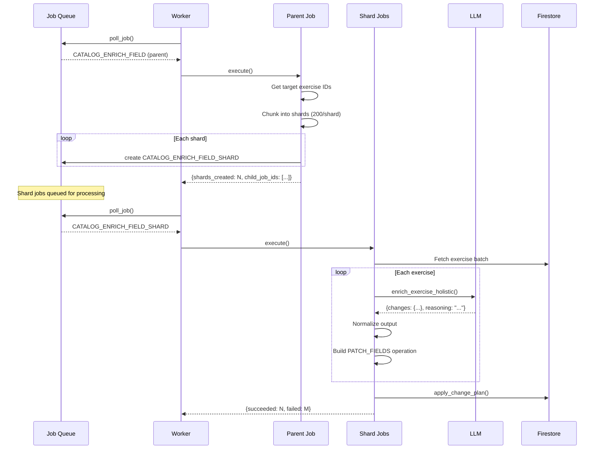
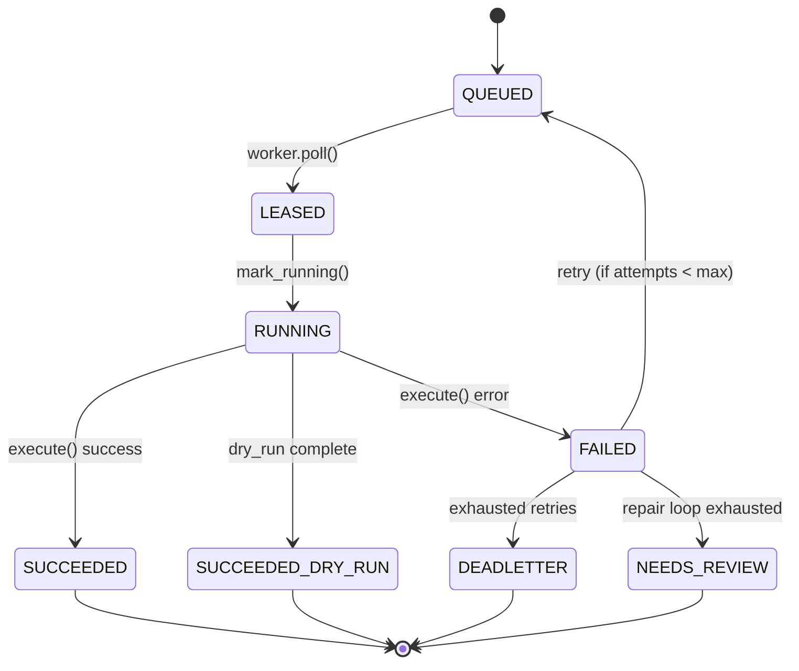
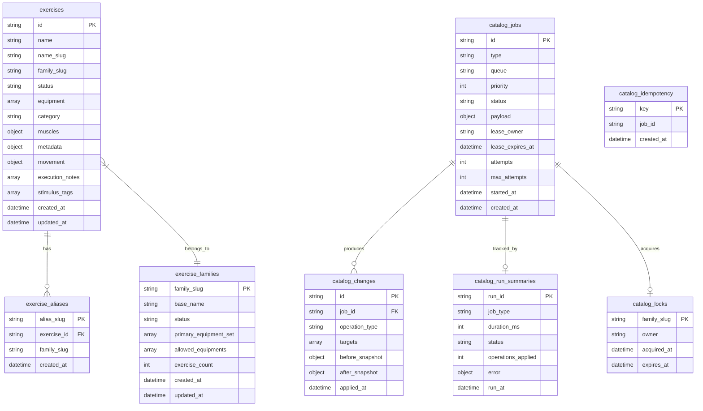
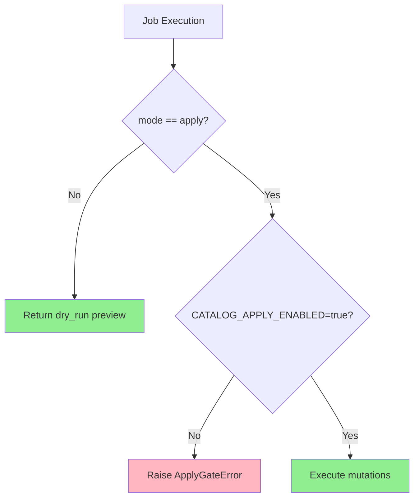
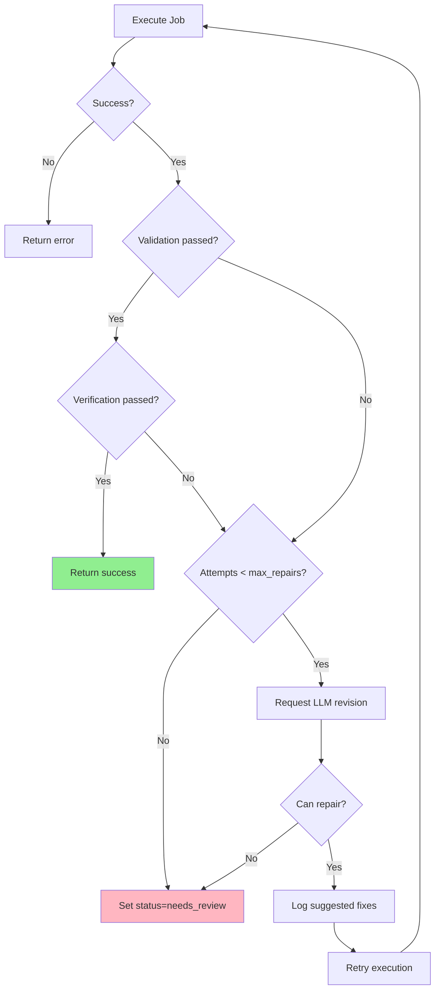
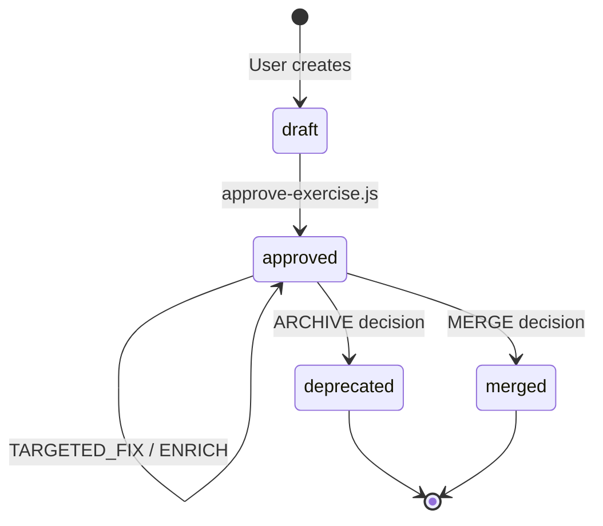
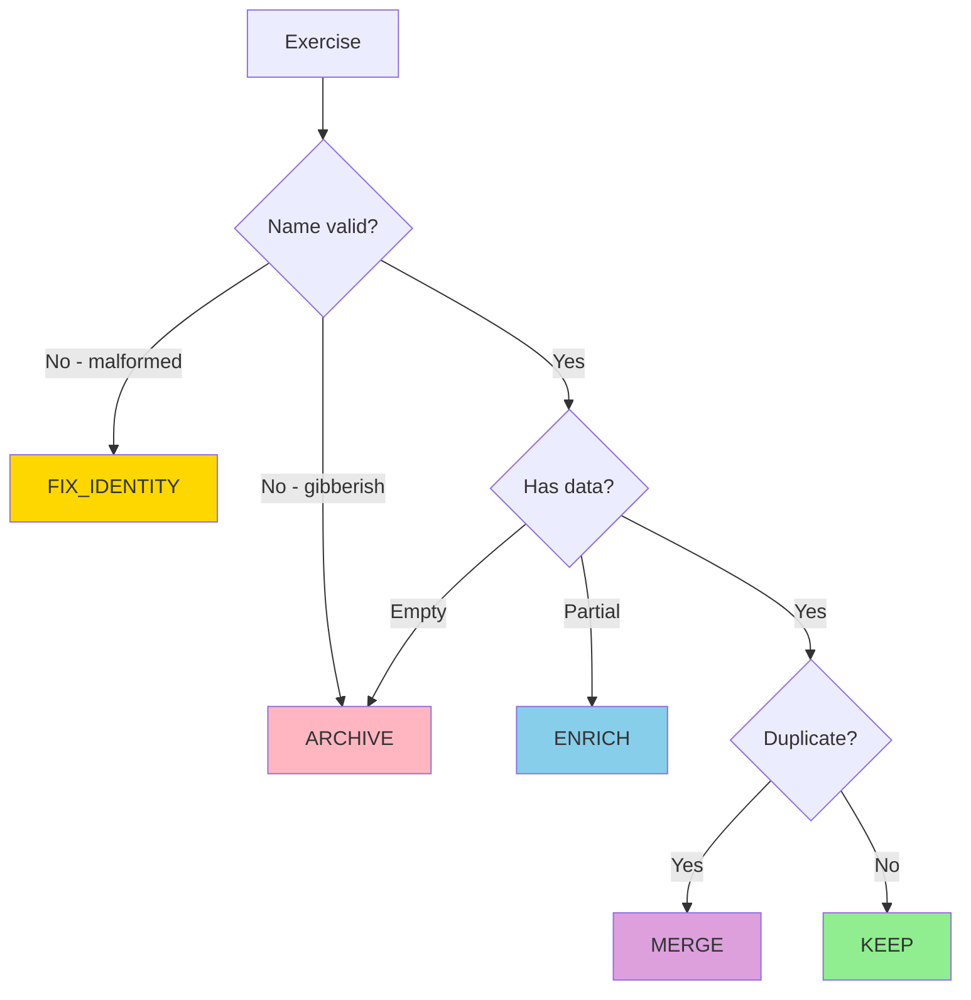
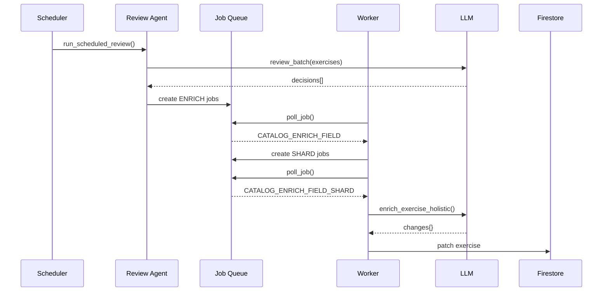

# Catalog Orchestrator Architecture

## Overview

The **Catalog Orchestrator** is an automated catalog curation system that maintains and enriches the exercise catalog. It runs as a set of Cloud Run Jobs triggered on schedule, performing:

1. **Quality Audits** - Detecting exercises with missing/invalid fields
2. **Gap Analysis** - Finding missing equipment variants (e.g., "Squat (Kettlebell)" if missing)
3. **Enrichment** - Using LLM to populate missing fields intelligently
4. **Duplicate Detection** - Identifying and clustering duplicate exercises
5. **Batch Processing** - Executing fix jobs safely with journaling

---

## System Data Flow

```mermaid
flowchart TB
    subgraph Trigger["⏰ Scheduled Trigger"]
        SCHEDULER[Cloud Scheduler]
    end

    subgraph Review["📋 Review Phase"]
        SCHEDULED[scheduled_review.py]
        REVIEWER[CatalogReviewAgent]
        GAP[FamilyGapAnalyzer]
        CREATOR[ReviewJobCreator]
    end

    subgraph Queue["📦 Job Queue (Firestore)"]
        JOBS[(catalog_jobs)]
        LOCKS[(catalog_locks)]
        IDEM[(catalog_idempotency)]
    end

    subgraph Execution["⚡ Execution Phase"]
        WORKER[CatalogWorker]
        EXECUTOR[JobExecutor]
        HANDLERS[Handlers]
    end

    subgraph Apply["✅ Apply Phase"]
        ENGINE[ApplyEngine]
        GATE[ValidationGate]
        JOURNAL[(catalog_changes)]
    end

    subgraph Data["🗄️ Catalog Data"]
        EXERCISES[(exercises collection)]
        ALIASES[(aliases collection)]
    end

    SCHEDULER --> SCHEDULED
    SCHEDULED --> REVIEWER
    SCHEDULED --> GAP
    REVIEWER --> CREATOR
    GAP --> CREATOR
    CREATOR --> JOBS
    CREATOR -.->|check| IDEM

    WORKER --> EXECUTOR
    EXECUTOR -->|dispatch| HANDLERS
    EXECUTOR -->|acquire| LOCKS
    JOBS --> WORKER

    HANDLERS --> ENGINE
    ENGINE --> GATE
    GATE -->|validate| ENGINE
    ENGINE --> JOURNAL
    ENGINE --> EXERCISES
    ENGINE --> ALIASES
```



---

## Exercise Data Schema

The exercise document structure is the core data model for the catalog.

### Complete Document Structure

```typescript
interface Exercise {
  // Identity Fields (LOCKED - never modified by enrichment)
  name: string;                    // "Romanian Deadlift (Dumbbell)"
  name_slug: string;               // "romanian_deadlift_dumbbell"
  family_slug: string;             // "deadlift"
  status: "approved" | "deprecated" | "merged" | "draft";

  // Equipment
  equipment: string[];             // ["dumbbell"]

  // Category
  category: "compound" | "isolation" | "cardio" | "mobility" | "core";

  // Muscle Mapping (New Schema)
  muscles: {
    primary: string[];             // ["hamstrings", "glutes"]
    secondary: string[];           // ["erector spinae", "latissimus dorsi"]
    category: string[];            // ["legs"]
    contribution: {                // Map of muscle -> decimal (0.0-1.0, sum to ~1.0)
      [muscle: string]: number;    // {"hamstrings": 0.45, "glutes": 0.30, ...}
    };
  };

  // Metadata
  metadata: {
    level: "beginner" | "intermediate" | "advanced";
    plane_of_motion: "sagittal" | "frontal" | "transverse" | "multi-plane";
    unilateral: boolean;
  };

  // Movement Pattern
  movement: {
    type: "push" | "pull" | "hinge" | "squat" | "carry" | "rotation" |
          "flexion" | "extension" | "abduction" | "adduction" | "other";
    split: "upper" | "lower" | "full_body" | "core";
  };

  // Content Arrays (Enrichable)
  execution_notes: string[];       // Key form cues
  common_mistakes: string[];       // What to avoid
  coaching_cues: string[];         // Trainer instructions
  suitability_notes: string[];     // Who this is suitable for
  programming_use_cases: string[]; // When to use in programs
  stimulus_tags: string[];         // ["Hypertrophy", "Compound Movement", ...]

  // Legacy Fields (still supported)
  instructions: string;            // Step-by-step instructions
  description: string;             // Brief description
  tips: string[];                  // Usage tips

  // System Fields
  created_at: Timestamp;
  updated_at: Timestamp;
  created_by: string;
  version: number;
}
```

### Field Categories

| Category | Fields | Enrichable | Notes |
|----------|--------|------------|-------|
| **Identity** | name, name_slug, family_slug, status | No | Derived from naming taxonomy |
| **Core** | equipment, category | Yes | Validated against canonical lists |
| **Muscles** | muscles.* | Yes | Anatomically accurate names |
| **Metadata** | metadata.* | Yes | Enum values validated |
| **Movement** | movement.* | Yes | Pattern classification |
| **Content** | execution_notes, common_mistakes, etc. | Yes | Free-form with quality guidelines |

Reference: `adk_agent/catalog_orchestrator/app/enrichment/engine.py:562-602`

---

## LLM Review Agent Deep Dive

The unified `CatalogReviewAgent` performs all review decisions in a single LLM call per batch.

### System Prompt

The agent is instructed with a comprehensive role definition:

```
You are the Povver Catalog Review Agent. Your role is to maintain a
high-quality exercise catalog that helps users train effectively.

## Your Capabilities

1. **Health Triage**: Evaluate each exercise and decide:
   - KEEP: Exercise is good quality, no action needed
   - ENRICH: Exercise is salvageable but missing data
   - FIX_IDENTITY: Name or family_slug is malformed
   - ARCHIVE: Exercise is a mistake, test data, or unsalvageable

2. **Duplicate Detection**: Identify exercises that are:
   - True duplicates (same exercise, different names) → merge
   - Valid variants (same movement, different equipment) → keep separate

3. **Gap Analysis**: Identify missing equipment variants that would add value
```

### Canonical Naming Taxonomy

The agent enforces naming conventions:

**Correct Format**: `"Exercise Name (Equipment)"` or `"Modifier Exercise Name (Equipment)"`

| Correct | Incorrect |
|---------|-----------|
| Deadlift (Barbell) | Conventional Deadlift |
| Wide-grip Lat Pulldown (Cable) | Barbell Deadlift |
| Romanian Deadlift (Dumbbell) | Lat Pulldown (when variants exist) |

### Decision Framework

Before every decision, the agent evaluates:

1. Would this change actually help a user?
2. Is the current state causing confusion or safety issues?
3. Am I changing this because it's wrong, or just because it's different from my preference?

**If the answer to #1 is "not really" → KEEP as-is.**

### Decision Types

| Decision | Criteria | Action |
|----------|----------|--------|
| **KEEP** | Exercise is good quality | No action |
| **ENRICH** | Missing instructions, muscles, or category | Create CATALOG_ENRICH_FIELD job |
| **FIX_IDENTITY** | Truncated family_slug, wrong naming format | Create TARGETED_FIX job |
| **ARCHIVE** | Gibberish name, empty data, test entries | Create archive job |
| **MERGE** | Same exercise with different names | Create merge job |

### Confidence Levels

| Level | Meaning | Behavior |
|-------|---------|----------|
| **HIGH** | Certain this needs action (or doesn't) | Proceed with decision |
| **MEDIUM** | Fairly sure but could be wrong | Proceed but note uncertainty |
| **LOW** | Unsure if this is a problem | Flag for human review, don't act |

### Few-Shot Examples

The agent is calibrated with examples:

```json
// Example 1: Good Exercise → KEEP
{
  "id": "squat_barbell",
  "name": "Back Squat (Barbell)",
  "equipment": ["barbell"],
  "instructions": "1. Set barbell on squat rack...",
  "muscles": {"primary": ["quadriceps", "glutes"]}
}
Decision: KEEP
Reasoning: "Exercise has clear name, correct muscles, and usable instructions."

// Example 2: Malformed Entry → ARCHIVE
{
  "id": "test123",
  "name": "asdfasdf",
  "equipment": [],
  "instructions": ""
}
Decision: ARCHIVE
Reasoning: "This appears to be test data. Name is gibberish, no useful content."

// Example 3: Truncated Family Slug → FIX_IDENTITY
{
  "id": "dead_bug_1",
  "name": "Dead Bug",
  "family_slug": "bug"  // Wrong! Should be "dead_bug"
}
Decision: FIX_IDENTITY
fix_details: {"family_slug": "dead_bug"}

// Example 4: Missing Data → ENRICH
{
  "id": "curl_001",
  "name": "Bicep Curl (Dumbbell)",
  "equipment": ["dumbbell"],
  "instructions": "",
  "muscles": {}
}
Decision: ENRICH
Reasoning: "Valid exercise but missing instructions and muscle mapping."

// Example 5: True Duplicate → MERGE
"Barbell Deadlift" (id: deadlift_barbell)
"Deadlift (Barbell)" (id: deadlift_001)
Decision for deadlift_barbell: MERGE into deadlift_001
Reasoning: "Same exercise with different naming. Keep canonical format."
```

### Output Schema

```json
{
  "exercises": [{
    "exercise_id": "string",
    "decision": "KEEP" | "ENRICH" | "FIX_IDENTITY" | "ARCHIVE" | "MERGE",
    "confidence": "high" | "medium" | "low",
    "reasoning": "string",
    "fix_details": { ... },      // For FIX_IDENTITY
    "merge_into": "exercise_id"  // For MERGE
  }],
  "duplicates": [{
    "canonical_id": "string",
    "canonical_name": "string",
    "duplicate_ids": ["string"],
    "reasoning": "string"
  }],
  "gaps": [{
    "family_slug": "string",
    "missing_equipment": "string",
    "suggested_name": "string",
    "reasoning": "string",
    "confidence": "string"
  }]
}
```

Reference: `adk_agent/catalog_orchestrator/app/reviewer/review_agent.py:38-228`

---

## Holistic Enrichment Engine

The enrichment engine uses LLM to populate missing fields intelligently.

### Architecture


### Enrichment Modes

| Mode | Description | Use Case |
|------|-------------|----------|
| **Single-field** | Enrich one specific field | Legacy mode, targeted fixes |
| **Holistic** | Pass full doc, LLM decides what to update | Reviewer-driven enrichment |

### Locked Fields

These fields are NEVER modified by enrichment:

```python
LOCKED_FIELDS = {
    "name",
    "name_slug",
    "family_slug",
    "status",
    "created_at",
    "updated_at",
    "doc_id",
    "id",
}
```

### Enrichable Fields

```python
ENRICHABLE_FIELD_PATHS = {
    # Legacy fields
    "instructions", "equipment", "category",
    "primary_muscles", "secondary_muscles",

    # New schema muscle fields
    "muscles.primary", "muscles.secondary",
    "muscles.category", "muscles.contribution",

    # Metadata
    "metadata.level", "metadata.plane_of_motion", "metadata.unilateral",

    # Movement
    "movement.type", "movement.split",

    # Content arrays
    "execution_notes", "common_mistakes", "suitability_notes",
    "programming_use_cases", "stimulus_tags", "coaching_cues",
    "tips", "description",
}
```

### Prompt Structure

The holistic enrichment prompt includes:

1. **WHAT_GOOD_LOOKS_LIKE** - Philosophy and principles
2. **INSTRUCTIONS_GUIDANCE** - How to write good instructions
3. **MUSCLE_MAPPING_GUIDANCE** - Anatomical accuracy rules
4. **Reference Example** - A golden example for comparison
5. **Current Exercise Data** - The document to enrich
6. **Rules** - What can/cannot be changed
7. **Priority Fields** - What to focus on if missing

```
## Priority Fields to Generate (if missing)

1. **muscles.contribution** - Map of muscle name to decimal contribution
2. **stimulus_tags** - 4-6 training stimulus tags in Title Case
3. **programming_use_cases** - 3-5 complete sentences
4. **suitability_notes** - 2-4 notes about suitability
5. **category** - Must be one of: compound, isolation, cardio, mobility, core
6. **muscles.primary** - If empty, add 1-3 primary muscles
```

### Response Format

```json
{
  "reasoning": "Brief explanation of changes",
  "confidence": "high" | "medium" | "low",
  "changes": {
    "muscles.contribution": {"quadriceps": 0.45, "glutes": 0.30, ...},
    "stimulus_tags": ["Hypertrophy", "Compound Movement", ...],
    "programming_use_cases": ["Sentence 1.", "Sentence 2.", ...],
    "suitability_notes": ["Note 1.", "Note 2.", ...],
    "category": "compound"
  }
}
```

### Output Normalization

After LLM response, changes are normalized:

| Field | Normalization |
|-------|---------------|
| `muscles.primary/secondary` | Underscores → spaces, lowercase, dedupe |
| `muscles.contribution` | Keys normalized, values clamped to 0.0-1.0 |
| `stimulus_tags` | Title case, dedupe by lowercase |
| `category` | Validated against allowed values, fallback to "compound" |

Reference: `adk_agent/catalog_orchestrator/app/enrichment/engine.py:710-1004`

---

## Complete Job Types Reference

| Type | Category | Purpose | Lock Required | Queue |
|------|----------|---------|---------------|-------|
| **MAINTENANCE_SCAN** | Scan | Emit targeted jobs from family scan | No | maintenance |
| **DUPLICATE_DETECTION_SCAN** | Scan | Find potential duplicate families | No | maintenance |
| **ALIAS_INVARIANT_SCAN** | Scan | Find broken alias references | No | maintenance |
| **FAMILY_AUDIT** | Family | Analyze and report family issues | No | priority |
| **FAMILY_NORMALIZE** | Family | Add equipment qualifiers to names | Yes | priority |
| **FAMILY_MERGE** | Family | Merge two families into one | Yes | priority |
| **FAMILY_SPLIT** | Family | Split family by equipment | Yes | priority |
| **FAMILY_RENAME_SLUG** | Family | Rename a family slug | Yes | priority |
| **EXERCISE_ADD** | Exercise | Create new exercise | Yes | priority |
| **TARGETED_FIX** | Exercise | Patch specific fields on exercises | Yes | priority |
| **ALIAS_REPAIR** | Alias | Fix broken alias references | Yes | priority |
| **CATALOG_ENRICH_FIELD** | Enrichment | Parent job - shards exercises | No | maintenance |
| **CATALOG_ENRICH_FIELD_SHARD** | Enrichment | Process batch with LLM | Yes | maintenance |
| **SCHEMA_CLEANUP** | Maintenance | Remove deprecated fields | Yes | maintenance |

Reference: `adk_agent/catalog_orchestrator/app/jobs/models.py:22-48`

---

## Data Flow Per Job Type

### Scheduled Review Flow

```mermaid
sequenceDiagram
    participant S as Cloud Scheduler
    participant R as scheduled_review.py
    participant DB as Firestore (exercises)
    participant L as CatalogReviewAgent
    participant Q as Job Queue

    S->>R: Trigger review
    R->>DB: fetch_all_exercises(max=1000)
    DB-->>R: exercises[]

    loop Each batch (20 exercises)
        R->>L: review_batch(exercises)
        L->>L: Build prompt with SYSTEM_PROMPT
        L->>L: Call Gemini 2.5 Pro
        L-->>R: BatchReviewResult
    end

    R->>R: Aggregate all decisions
    R->>Q: create_jobs_from_decisions()

    Note over Q: ENRICH → CATALOG_ENRICH_FIELD
    Note over Q: FIX_IDENTITY → TARGETED_FIX
    Note over Q: ARCHIVE → TARGETED_FIX (archive)
    Note over Q: Gap → EXERCISE_ADD
```



### CATALOG_ENRICH_FIELD Sharding Flow



### Job Execution State Machine



---

## Firestore Collections

### Collection Schema



### exercises Collection

| Field | Type | Description |
|-------|------|-------------|
| `id` | string | Document ID (auto-generated or deterministic) |
| `name` | string | Display name following naming taxonomy |
| `name_slug` | string | URL-safe slug derived from name |
| `family_slug` | string | Groups exercises by movement pattern |
| `status` | string | approved, deprecated, merged, draft |
| `equipment` | array | Equipment list (singular, lowercase) |
| `category` | string | compound, isolation, cardio, mobility, core |
| `muscles` | object | {primary: [], secondary: [], category: [], contribution: {}} |
| `metadata` | object | {level, plane_of_motion, unilateral} |
| `movement` | object | {type, split} |
| `execution_notes` | array | Key form cues |
| `stimulus_tags` | array | Training stimulus tags |
| `created_at` | timestamp | Creation timestamp |
| `updated_at` | timestamp | Last update timestamp |

### exercise_families Collection

| Field | Type | Description |
|-------|------|-------------|
| `family_slug` | string | Primary key (e.g., "deadlift") |
| `base_name` | string | Human-readable base name |
| `status` | string | active, deprecated, merged |
| `primary_equipment_set` | array | All equipment used in family |
| `allowed_equipments` | array | Valid equipment for this family |
| `exercise_count` | number | Count of exercises in family |
| `created_at` | timestamp | Creation timestamp |
| `updated_at` | timestamp | Last update timestamp |

### catalog_jobs Collection

| Field | Type | Description |
|-------|------|-------------|
| `id` | string | Job ID (UUID) |
| `type` | string | JobType enum value |
| `queue` | string | "priority" or "maintenance" |
| `priority` | number | Higher = more urgent (default: 100) |
| `status` | string | queued, leased, running, succeeded, failed, etc. |
| `payload` | object | Job-specific parameters |
| `lease_owner` | string | Worker ID holding the lease |
| `lease_expires_at` | timestamp | When lease expires |
| `attempts` | number | Execution attempt count |
| `max_attempts` | number | Maximum retry attempts (default: 5) |
| `started_at` | timestamp | When execution started |
| `created_at` | timestamp | Job creation timestamp |

---

## Firebase Functions Integration

The catalog orchestrator writes to the same Firestore collections read by Firebase Functions.

### Exercise Resolution Chain

```mermaid
flowchart LR
    subgraph User["User Action"]
        LOG[User logs workout]
        NAME[Exercise name text]
    end

    subgraph Resolution["resolve-exercise.js"]
        SLUG[toSlug(name)]
        Q1[Query by name_slug]
        Q2[Query by alias_slugs]
        SCORE[Score & rank]
    end

    subgraph Data["Firestore"]
        EX[(exercises)]
    end

    NAME --> SLUG
    SLUG --> Q1
    Q1 --> EX
    SLUG --> Q2
    Q2 --> EX
    EX --> SCORE
    SCORE --> LOG
```

### Functions that READ Catalog

These functions consume catalog data that the orchestrator may modify:

| Function | Purpose | Fields Used |
|----------|---------|-------------|
| `resolve-exercise.js` | Match user input to exercise | name_slug, alias_slugs, equipment, status |
| `ensure-exercise-exists.js` | Create exercise if not found | name_slug, family_slug, variant_key |
| `get-exercise.js` | Fetch single exercise | All fields |
| `get-exercises.js` | Fetch multiple exercises | All fields |
| `search-exercises.js` | Full-text search | name, muscles, equipment |
| `list-families.js` | List exercise families | family_slug, exercise_count |

### Functions that WRITE Catalog

These functions may write to the catalog, potentially conflicting with orchestrator:

| Function | Purpose | Risk Level |
|----------|---------|------------|
| `approve-exercise.js` | Sets status=approved | Low - different field |
| `merge-exercises.js` | Manual exercise merge | High - overlaps FAMILY_MERGE |
| `upsert-exercise.js` | Admin creates/updates | High - can conflict |
| `refine-exercise.js` | Update exercise fields | Medium - overlaps TARGETED_FIX |

### Coordination Notes

1. **Orchestrator uses family locks** to prevent concurrent writes within the same family
2. **Functions don't use locks** - they handle real-time user operations
3. **Orchestrator jobs are idempotent** - safe to retry after Function writes
4. **No cross-system locking** - Functions can write while orchestrator runs

### Race Condition Handling

```
Scenario: User approves exercise while TARGETED_FIX is running

Timeline:
  T0: TARGETED_FIX starts, reads exercise
  T1: User calls approve-exercise.js, sets status=approved
  T2: TARGETED_FIX writes patch (different fields)

Result: Both writes succeed - no conflict
  - status = approved (from user)
  - other fields patched (from orchestrator)
```

---

## Apply Gate and Mode Semantics

The apply gate is a hard safety mechanism preventing accidental mutations.

### Environment Variables

| Variable | Purpose | Values |
|----------|---------|--------|
| `CATALOG_APPLY_ENABLED` | Hard gate for mutations | `true` to enable |
| `USE_MOCK_LLM` | Use mock LLM for testing | `true` for testing |
| `FIRESTORE_EMULATOR_HOST` | Use Firestore emulator | Emulator address |

### Gate Hierarchy



### Mode Behavior

| Mode | CATALOG_APPLY_ENABLED | Result |
|------|----------------------|--------|
| `dry_run` | Any | Returns preview, no mutations |
| `apply` | `false` or unset | Raises `ApplyGateError` |
| `apply` | `true` | Executes mutations |

### ApplyGateError

```python
class ApplyGateError(Exception):
    """Raised when apply gate blocks a mutation."""

    # Raised with message:
    # "Apply mode blocked. Set CATALOG_APPLY_ENABLED=true to enable catalog mutations."
```

Reference: `adk_agent/catalog_orchestrator/app/apply/gate.py`

---

## Repair Loop

The repair loop provides automatic error recovery with LLM assistance.

### execute_with_repair_loop Flow



### Repair Process

1. **Execute job** - Run the job handler
2. **Check validation** - Validate the change plan
3. **If validation fails** - Log errors, request LLM revision
4. **LLM analyzes errors** - Suggests specific fixes
5. **Retry** - Up to `max_repairs` times (default: 3)
6. **If exhausted** - Set status=`needs_review`

### LLM Repair Prompt

```
You are a catalog curation expert. A change plan failed validation.

## Job Context
Job ID: {job_id}
Job Type: {job_type}
Family: {family_slug}
Mode: {mode}

## Current Plan (Failed)
{plan_json}

## Validation Errors
- INVALID_PATCH_PATHS: Field path not in allowlist
- DUPLICATE_OPERATION: Operation already applied
- ...

## Your Task
Analyze why the plan failed and suggest specific fixes.

## Response Format
{
    "can_repair": true/false,
    "analysis": "Brief analysis",
    "suggested_fixes": [
        {"operation_index": 0, "fix_type": "remove", "description": "..."}
    ],
    "confidence": "high" | "medium" | "low"
}
```

### Current Behavior

The repair loop is **conservative**:
- Suggestions are **logged but not auto-applied**
- LLM analysis helps diagnose issues
- Human review required for actual repair

Reference: `adk_agent/catalog_orchestrator/app/jobs/executor.py:1165-1420`

---

## State Diagrams

### Exercise Lifecycle



### Review Agent Decision Tree



### Sharded Enrichment Flow



---

## Component Details

### 1. Review Phase

#### scheduled_review.py
Entry point triggered by Cloud Scheduler. Orchestrates:
1. Fetches all exercises from catalog
2. Runs `CatalogReviewAgent.review_batch()` for unified decisions
3. Creates jobs via `create_jobs_from_decisions()`

#### CatalogReviewAgent
Unified LLM agent that performs:
- Health triage (KEEP, ENRICH, FIX, ARCHIVE, MERGE)
- Duplicate detection and clustering
- Equipment gap suggestions

Uses single LLM call per batch (default: 20 exercises).

#### FamilyGapAnalyzer
Detects missing equipment variants using affinity maps:
```python
EQUIPMENT_AFFINITIES = {
    "squat": ["barbell", "dumbbell", "kettlebell", "smith_machine"],
    "curl": ["barbell", "dumbbell", "cable", "ez_bar"],
    ...
}
```

### 2. Job Queue

#### Job Model
```python
@dataclass
class Job:
    id: str
    type: JobType          # TARGETED_FIX, EXERCISE_ADD, etc.
    queue: JobQueue        # priority or maintenance
    priority: int          # Higher = more urgent
    status: JobStatus      # queued, running, succeeded, failed
    payload: JobPayload    # family_slug, exercise_doc_ids, mode
    lease_owner: str       # Worker ID holding the job
    lease_expires_at: datetime
    attempts: int
    max_attempts: int
```

### 3. Execution Phase

#### CatalogWorker
Long-running worker that:
1. Polls for available jobs
2. Acquires family-level locks
3. Dispatches to appropriate handler
4. Updates job status and run history

#### JobExecutor
Routes jobs to specific handlers based on job type. Supports repair loop for automatic error recovery.

### 4. Apply Phase

#### ApplyEngine
Executes `ChangePlan` operations:
1. Enforces apply gate
2. Validates patch paths against allowlist
3. Checks idempotency for each operation
4. Takes before-snapshots
5. Applies mutations with dotted Firestore paths
6. Records in journal
7. Verifies post-state

---

## Deployment

### Cloud Run Jobs

| Job | Schedule | Purpose |
|-----|----------|---------|
| `catalog-reviewer` | Daily 2 AM | Run scheduled_review.py |
| `catalog-worker` | On-demand | Process job queue |
| `catalog-watchdog` | Every 15 min | Recover stuck jobs |

### Environment Variables
```
FIRESTORE_PROJECT=myon-53d85
CATALOG_SHELL_MODEL=gemini-2.5-pro
CATALOG_APPLY_ENABLED=true
USE_MOCK_LLM=false
```

---

## Error Handling

### Retry Logic
Jobs have exponential backoff with jitter:
```python
def compute_backoff_seconds(attempts: int) -> int:
    base = 300  # 5 minutes
    delay = min(base * (2 ** attempts), 3600)  # max 1 hour
    jitter = random.randint(0, 60)
    return delay + jitter
```

### Watchdog Recovery
The watchdog job:
1. Finds jobs with `status=running` and `lease_expires_at < now`
2. Resets them to `status=queued` for retry
3. Releases orphaned locks

---

## Integration Points

### External Dependencies
- **Firestore**: All persistent state
- **Vertex AI**: Gemini 2.5 Pro for enrichment and review
- **Cloud Scheduler**: Triggers scheduled_review
- **Cloud Run**: Execution environment

### Internal Connections
- **exercises collection**: Source data for review
- **exercise_aliases collection**: Updated by rename operations
- **Firebase Functions**: Read/write same collections

---

## File Index

Quick reference for locating code. All paths relative to `adk_agent/catalog_orchestrator/`.

### Core Modules

| Component | Primary File | Purpose |
|-----------|--------------|---------|
| **Entry Points** | | |
| CLI | `cli.py` | Command-line interface |
| Worker | `workers/catalog_worker.py` | Long-running job processor |
| Interactive | `interactive_chat.py` | Chat-based interaction |
| **Review Phase** | | |
| Scheduled Review | `app/reviewer/scheduled_review.py` | Cloud Run Job entry point |
| Review Agent | `app/reviewer/review_agent.py` | Unified LLM review agent |
| Gap Analyzer | `app/reviewer/family_gap_analyzer.py` | Equipment gap detection |
| Job Creator | `app/reviewer/review_job_creator.py` | Creates jobs from decisions |
| Philosophy | `app/reviewer/what_good_looks_like.py` | LLM reasoning guidelines |
| Legacy Reviewer | `app/reviewer/catalog_reviewer.py` | Rule-based reviewer |
| **Enrichment** | | |
| Engine | `app/enrichment/engine.py` | Core enrichment logic |
| LLM Client | `app/enrichment/llm_client.py` | Gemini API wrapper |
| Field Guide | `app/enrichment/exercise_field_guide.py` | Field specs and examples |
| Models | `app/enrichment/models.py` | EnrichmentSpec, EnrichmentResult |
| Validators | `app/enrichment/validators.py` | Output validation |
| **Jobs** | | |
| Executor | `app/jobs/executor.py` | Main job dispatcher |
| Handlers | `app/jobs/handlers.py` | Additional job handlers |
| Models | `app/jobs/models.py` | Job, JobType, JobStatus |
| Queue | `app/jobs/queue.py` | Queue operations |
| Watchdog | `app/jobs/watchdog.py` | Stuck job recovery |
| Run History | `app/jobs/run_history.py` | Execution history |
| **Apply** | | |
| Engine | `app/apply/engine.py` | Mutation executor |
| Gate | `app/apply/gate.py` | Apply safety gate |
| Paths | `app/apply/paths.py` | Field path validation |
| Journal | `app/apply/journal.py` | Change journaling |
| Idempotency | `app/apply/idempotency.py` | Idempotency guard |
| **Plans** | | |
| Models | `app/plans/models.py` | ChangePlan, Operation |
| Compiler | `app/plans/compiler.py` | Plan generation |
| Validators | `app/plans/validators.py` | Plan validation |
| State Compiler | `app/plans/state_compiler.py` | State-based planning |
| **Family** | | |
| Models | `app/family/models.py` | FamilyRegistry, ExerciseSummary |
| Registry | `app/family/registry.py` | Family CRUD operations |
| Taxonomy | `app/family/taxonomy.py` | Slug derivation rules |
| **Shell Agent** | | |
| Agent | `app/shell/agent.py` | ADK agent definition |
| Tools | `app/shell/tools.py` | Agent tool definitions |
| Instruction | `app/shell/instruction.py` | System prompt |
| Context | `app/shell/context.py` | Job context management |
| Planner | `app/shell/planner.py` | Plan generation |
| **Scripts** | | |
| Export Exercises | `scripts/export_exercises.py` | Export catalog to JSON |
| Queue Enrichment | `scripts/queue_enrichment_jobs.py` | Batch queue jobs |
| Schema Cleanup | `scripts/queue_schema_cleanup.py` | Remove deprecated fields |
| Reset Jobs | `scripts/reset_stuck_jobs.py` | Reset stuck jobs |

---

## Import/Dependency Graph

### Module Dependencies

```
┌─────────────────────────────────────────────────────────────────┐
│                         Entry Points                            │
│  cli.py, workers/catalog_worker.py, scheduled_review.py        │
└─────────────────────────────────────────────────────────────────┘
                              │
                              ▼
┌─────────────────────────────────────────────────────────────────┐
│                      jobs/executor.py                           │
│  Central dispatcher - routes jobs to handlers                   │
│                                                                 │
│  Imports:                                                       │
│  ├── jobs/models.py (Job, JobType)                              │
│  ├── jobs/handlers.py (split, rename, alias handlers)          │
│  ├── family/registry.py (get_family_exercises, ...)            │
│  ├── family/taxonomy.py (derive_name_slug, ...)                │
│  ├── plans/models.py (ChangePlan, ValidationResult)            │
│  ├── plans/compiler.py (create_audit_plan, ...)                │
│  └── plans/validators.py (validate_change_plan)                │
└─────────────────────────────────────────────────────────────────┘
                              │
                              ▼
┌─────────────────────────────────────────────────────────────────┐
│                      apply/engine.py                            │
│  Executes ChangePlan mutations                                  │
│                                                                 │
│  Imports:                                                       │
│  ├── plans/models.py (ChangePlan, Operation, OperationType)    │
│  ├── apply/idempotency.py (IdempotencyGuard)                   │
│  ├── apply/journal.py (ChangeJournal)                          │
│  ├── apply/gate.py (ApplyGateError, check_apply_gate)          │
│  └── apply/paths.py (validate_patch_paths, DELETE_SENTINEL)    │
└─────────────────────────────────────────────────────────────────┘
                              │
                              ▼
                        [Firestore]
```

### Enrichment Module Dependencies

```
enrichment/engine.py
├── enrichment/models.py ──────── EnrichmentSpec, EnrichmentResult
├── enrichment/llm_client.py ──── LLMClient, get_llm_client
├── enrichment/validators.py ──── validate_enrichment_output, parse_llm_response
└── enrichment/exercise_field_guide.py
    ├── FIELD_SPECS ─────────── Field definitions and constraints
    ├── GOLDEN_EXAMPLES ─────── Reference exercises
    └── MUSCLE_NORMALIZATION ── Muscle name mappings
```

### Review Module Dependencies

```
reviewer/scheduled_review.py
├── reviewer/review_agent.py
│   └── enrichment/llm_client.py
├── jobs/models.py (JobType, JobQueue)
└── jobs/queue.py (create_job)

reviewer/review_agent.py
├── enrichment/llm_client.py ──── get_llm_client, LLMClient
└── [uses] reviewer/what_good_looks_like.py (philosophy strings)

reviewer/family_gap_analyzer.py
├── jobs/models.py ────────────── JobType, JobQueue
└── reviewer/what_good_looks_like.py
```

### Cross-Module Import Summary

| Module | Imports From |
|--------|--------------|
| `executor.py` | jobs, family, plans |
| `apply/engine.py` | plans, apply/* |
| `enrichment/engine.py` | enrichment/* |
| `review_agent.py` | enrichment |
| `scheduled_review.py` | reviewer, jobs |
| `handlers.py` | family, plans |

---

## Real Data Examples

### Fully Enriched Exercise

From production Firestore - a complete exercise with all enriched fields:

```json
{
  "_doc_id": "back_extension__back-extension-hyperextension-bench",
  "name": "Back Extension (Hyperextension Bench)",
  "name_slug": "back-extension-hyperextension-bench",
  "family_slug": "back_extension",
  "status": "approved",

  "equipment": ["hyperextension_bench"],
  "category": "compound",
  "variant_key": "equipment:hyperextension_bench",

  "muscles": {
    "primary": ["Erector Spinae", "Gluteus Maximus", "Hamstrings"],
    "secondary": ["Adductor Magnus", "Gluteus Medius", "Quadratus Lumborum", "Transversus Abdominis"],
    "category": ["Back", "Glutes", "Hamstrings", "Adductors", "Core"],
    "contribution": {
      "Erector Spinae": 0.40,
      "Gluteus Maximus": 0.35,
      "Hamstrings": 0.15,
      "Adductor Magnus": 0.06,
      "Gluteus Medius": 0.02,
      "Quadratus Lumborum": 0.01,
      "Transversus Abdominis": 0.01
    }
  },

  "metadata": {
    "level": "beginner",
    "plane_of_motion": "sagittal",
    "unilateral": false
  },

  "movement": {
    "type": "hinge",
    "split": "lower"
  },

  "execution_notes": [
    "Position yourself on the hyperextension bench with your thighs resting on the pad and ankles secured.",
    "Cross your arms over your chest or place hands behind your head.",
    "Lower your torso by bending at the waist while keeping your back straight.",
    "Descend until you feel a stretch in your hamstrings.",
    "Raise your torso back to the starting position by contracting your lower back and glutes.",
    "Avoid hyperextending beyond a neutral spine position."
  ],

  "common_mistakes": [
    "Hyperextending the spine at the top of the movement.",
    "Using momentum to swing up instead of controlled contraction.",
    "Rounding the lower back during the descent."
  ],

  "stimulus_tags": ["Hypertrophy", "Strength", "Posterior Chain", "Lower Back", "Core Stability"],

  "programming_use_cases": [
    "Posterior chain strength and hypertrophy development.",
    "Core stability and spinal erector endurance.",
    "Warm-up or activation for compound lower body lifts.",
    "Rehabilitation and prehabilitation for lower back health."
  ],

  "suitability_notes": [
    "Suitable for all experience levels with appropriate ROM.",
    "Avoid if experiencing acute lower back pain.",
    "Progress by holding weight plate against chest."
  ],

  "updated_at": "2026-01-28T20:37:55.900000+00:00"
}
```

### Minimal Exercise (Needs Enrichment)

An exercise that would trigger ENRICH decision:

```json
{
  "_doc_id": "arnold_press__arnold-press-dumbbell",
  "name": "Arnold Press (Dumbbell)",
  "name_slug": "arnold-press-dumbbell",
  "family_slug": "arnold_press",
  "status": "approved",

  "equipment": ["dumbbell"],
  "category": "exercise",

  "muscles": {
    "primary": [],
    "secondary": [],
    "category": []
  },

  "metadata": {
    "level": "intermediate"
  },

  "movement": {
    "type": "other",
    "split": "upper"
  },

  "updated_at": "2026-01-28T20:37:55.900000+00:00"
}
```

**Review Agent Decision**: ENRICH
- Missing: muscles.primary, muscles.contribution, stimulus_tags, execution_notes
- category is "exercise" (invalid, should be "compound")

### catalog_jobs Document

```json
{
  "id": "job_abc123",
  "type": "CATALOG_ENRICH_FIELD_SHARD",
  "queue": "maintenance",
  "priority": 50,
  "status": "queued",

  "payload": {
    "family_slug": "arnold_press",
    "exercise_doc_ids": ["arnold_press__arnold-press-dumbbell"],
    "mode": "apply",
    "enrichment_spec": {
      "type": "holistic",
      "priority_fields": ["muscles.contribution", "stimulus_tags", "execution_notes"]
    }
  },

  "lease_owner": null,
  "lease_expires_at": null,
  "attempts": 0,
  "max_attempts": 5,

  "created_at": "2026-01-28T21:00:00.000Z",
  "started_at": null
}
```

### catalog_changes Journal Entry

```json
{
  "id": "change_xyz789",
  "job_id": "job_abc123",
  "operation_type": "PATCH_FIELDS",
  "targets": ["arnold_press__arnold-press-dumbbell"],

  "before_snapshot": {
    "category": "exercise",
    "muscles": {"primary": [], "secondary": [], "category": []}
  },

  "after_snapshot": {
    "category": "compound",
    "muscles": {
      "primary": ["anterior deltoid", "medial deltoid"],
      "secondary": ["triceps brachii", "trapezius"],
      "category": ["shoulders"],
      "contribution": {"anterior deltoid": 0.40, "medial deltoid": 0.30, "triceps brachii": 0.20, "trapezius": 0.10}
    }
  },

  "applied_at": "2026-01-28T21:05:00.000Z"
}
```

---

## How-To Recipes

### Add a New Job Type

1. **Add enum value** to `app/jobs/models.py`:
```python
class JobType(str, Enum):
    # ... existing types ...
    MY_NEW_JOB = "MY_NEW_JOB"
```

2. **Add handler function** in `app/jobs/handlers.py`:
```python
def execute_my_new_job(
    job_id: str,
    payload: Dict[str, Any],
    mode: str = "dry_run",
) -> Dict[str, Any]:
    """Execute MY_NEW_JOB."""
    # Validate payload
    required_field = payload.get("required_field")
    if not required_field:
        return {
            "success": False,
            "error": {"code": "MISSING_REQUIRED_FIELD", "message": "..."},
        }

    # Build operations
    operations = [...]

    # Create and apply plan
    plan = ChangePlan(job_id=job_id, job_type="MY_NEW_JOB", ...)

    if mode == "apply":
        engine = ApplyEngine(job_id, mode=mode)
        return engine.apply(plan).to_dict()

    return {"success": True, "dry_run_preview": [...]}
```

3. **Add dispatch case** in `app/jobs/executor.py`:
```python
def execute(job: Job) -> Dict[str, Any]:
    # ... existing cases ...
    elif job.type == JobType.MY_NEW_JOB:
        return execute_my_new_job(job.id, payload, mode)
```

4. **If job requires family lock**, add to the lock check:
```python
LOCK_REQUIRED_JOBS = {
    JobType.TARGETED_FIX,
    JobType.EXERCISE_ADD,
    # ...
    JobType.MY_NEW_JOB,  # Add here
}
```

### Modify the Enrichment Prompt

1. **Edit holistic prompt builder** in `app/enrichment/engine.py`:
```python
def _build_holistic_enrichment_prompt(exercise: Dict, ...) -> str:
    # Add your modifications here
```

2. **Update philosophy guidelines** in `app/reviewer/what_good_looks_like.py`:
```python
WHAT_GOOD_LOOKS_LIKE = """
# Add new guidance here
"""
```

3. **Test locally**:
```bash
cd adk_agent/catalog_orchestrator
export USE_MOCK_LLM=false
export CATALOG_APPLY_ENABLED=false
python -c "
from app.enrichment.engine import enrich_exercise_holistic
result = enrich_exercise_holistic({'name': 'Test', 'name_slug': 'test', ...})
print(result)
"
```

### Add a New Enrichable Field

1. **Add to ENRICHABLE_FIELD_PATHS** in `app/enrichment/engine.py`:
```python
ENRICHABLE_FIELD_PATHS = {
    # ... existing fields ...
    "my_new_field",
    "nested.new_field",
}
```

2. **Add to ALLOWED_FLAT_PATHS or ALLOWED_DEEP_PATHS_PREFIX** in `app/apply/paths.py`:
```python
ALLOWED_FLAT_PATHS = {
    # ... existing paths ...
    "my_new_field",
}
# OR for nested:
ALLOWED_DEEP_PATHS_PREFIX = (
    "muscles.",
    "metadata.",
    "nested.",  # Add prefix
)
```

3. **Add field spec** in `app/enrichment/exercise_field_guide.py`:
```python
FIELD_SPECS["my_new_field"] = {
    "type": "string",  # or "array", "object"
    "description": "What this field contains",
    "examples": ["example1", "example2"],
}
```

### Queue Enrichment Jobs Manually

```bash
cd adk_agent/catalog_orchestrator

# Queue for specific exercises
python scripts/queue_enrichment_jobs.py \
  --exercise-ids "doc_id_1,doc_id_2" \
  --mode dry_run

# Queue for entire family
python scripts/queue_enrichment_jobs.py \
  --family-slug "deadlift" \
  --mode dry_run

# Actually create jobs (not just preview)
python scripts/queue_enrichment_jobs.py \
  --family-slug "deadlift" \
  --mode apply \
  --create-jobs
```

### Reset Stuck Jobs

```bash
cd adk_agent/catalog_orchestrator

# Find stuck jobs (status=running, lease expired)
python scripts/reset_stuck_jobs.py --dry-run

# Actually reset them
python scripts/reset_stuck_jobs.py --apply
```

### Run Scheduled Review Locally

```bash
cd adk_agent/catalog_orchestrator

# Dry run - no jobs created
python -m app.reviewer.scheduled_review \
  --max-exercises 50 \
  --batch-size 20 \
  --dry-run \
  --verbose

# Create jobs but in dry_run mode
python -m app.reviewer.scheduled_review \
  --max-exercises 100 \
  --apply \
  --max-jobs 50
```

### Debug a Failed Job

1. **Find the job in Firestore**:
```python
from google.cloud import firestore
db = firestore.Client()
job_doc = db.collection("catalog_jobs").document("job_id").get()
print(job_doc.to_dict())
```

2. **Check the journal for what was attempted**:
```python
changes = db.collection("catalog_changes").where("job_id", "==", "job_id").stream()
for c in changes:
    print(c.to_dict())
```

3. **Re-run the job locally**:
```python
from app.jobs.executor import execute
from app.jobs.models import Job

# Reconstruct job from Firestore doc
job = Job.from_dict(job_doc.to_dict())
result = execute(job)
print(result)
```

---

## Error Codes Reference

### Apply Engine Errors (`app/apply/engine.py`)

| Code | Meaning | Fix |
|------|---------|-----|
| `INVALID_PATCH_PATHS` | Field path not in allowlist | Add path to `ALLOWED_FLAT_PATHS` or `ALLOWED_DEEP_PATHS_PREFIX` |
| `UNSUPPORTED_OP` | No handler for operation type | Add handler in `ApplyEngine` |
| `INVALID_OP` | Missing required fields in operation | Check operation has `targets` and `patch`/`after` |
| `DOC_NOT_FOUND` | Exercise document doesn't exist | Verify doc_id is correct |
| `ALIAS_BOTH_FIELDS` | Alias has both exercise_id and family_slug | Alias should have exactly one |
| `ALIAS_NO_TARGET` | Alias has neither exercise_id nor family_slug | Add one of the required fields |

### Apply Gate Errors (`app/apply/gate.py`)

| Code | Meaning | Fix |
|------|---------|-----|
| `APPLY_GATE_BLOCKED` | `CATALOG_APPLY_ENABLED` not set | Set `CATALOG_APPLY_ENABLED=true` in environment |

### Job Executor Errors (`app/jobs/executor.py`)

| Code | Meaning | Fix |
|------|---------|-----|
| `UNSUPPORTED_JOB_TYPE` | Unknown job type | Add handler for this JobType |
| `EXECUTION_ERROR` | Handler threw exception | Check logs for stack trace |
| `MISSING_FAMILY_SLUG` | Job requires family_slug | Include `family_slug` in payload |
| `MISSING_MERGE_CONFIG` | FAMILY_MERGE needs source/target | Include `source_family` and `target_family` |
| `MISSING_BASE_NAME` | EXERCISE_ADD needs intent.base_name | Include `intent.base_name` in payload |
| `DUPLICATE_EXERCISE` | Exercise with this slug already exists | Use different name or update existing |
| `DUPLICATE_EQUIPMENT_VARIANT` | Family already has this equipment | Skip or use different equipment |
| `MISSING_ENRICHMENT_SPEC` | Enrichment job needs spec | Include `enrichment_spec` in payload |
| `NO_EXERCISES_FOUND` | None of the target exercises exist | Verify exercise_doc_ids are correct |
| `SCAN_FAILED` | Failed to list families | Check Firestore connectivity |
| `REPAIR_LOOP_EXHAUSTED` | Max repairs attempted, still failing | Manual intervention needed |

### Job Handler Errors (`app/jobs/handlers.py`)

| Code | Meaning | Fix |
|------|---------|-----|
| `MISSING_SPLIT_CONFIG` | FAMILY_SPLIT needs config | Include `family_slug` and `split_config.target_family` |
| `MISSING_RENAME_CONFIG` | FAMILY_RENAME needs slugs | Include `old_family_slug` and `new_family_slug` |
| `MISSING_ALIAS_SLUGS` | ALIAS_REPAIR needs slugs | Include `alias_slugs` array |
| `MISSING_TARGETS` | Job needs exercise_doc_ids | Include `exercise_doc_ids` array |

### Watchdog Errors (`app/jobs/watchdog.py`)

| Code | Meaning | Fix |
|------|---------|-----|
| `LEASE_EXPIRED` | Job was running but lease expired | Job will be auto-reset to queued |

### Path Validation Errors (`app/apply/paths.py`)

| Error Type | Meaning | Fix |
|------------|---------|-----|
| `PathValidationError` | Field path not allowed for mutation | Add to `ALLOWED_FLAT_PATHS` or `ALLOWED_DEEP_PATHS_PREFIX` |

### Journal Errors (`app/apply/journal.py`)

| Code | Meaning | Fix |
|------|---------|-----|
| `JOURNAL_NOT_FOUND` | Change journal entry doesn't exist | Verify change_id is correct |

---

## See Also

- [DEPLOY.md](../adk_agent/catalog_orchestrator/DEPLOY.md) - Deployment instructions
- [SHELL_AGENT_ARCHITECTURE.md](./SHELL_AGENT_ARCHITECTURE.md) - Shell agent details
- [ALIAS_POLICY.md](./ALIAS_POLICY.md) - Alias management rules
